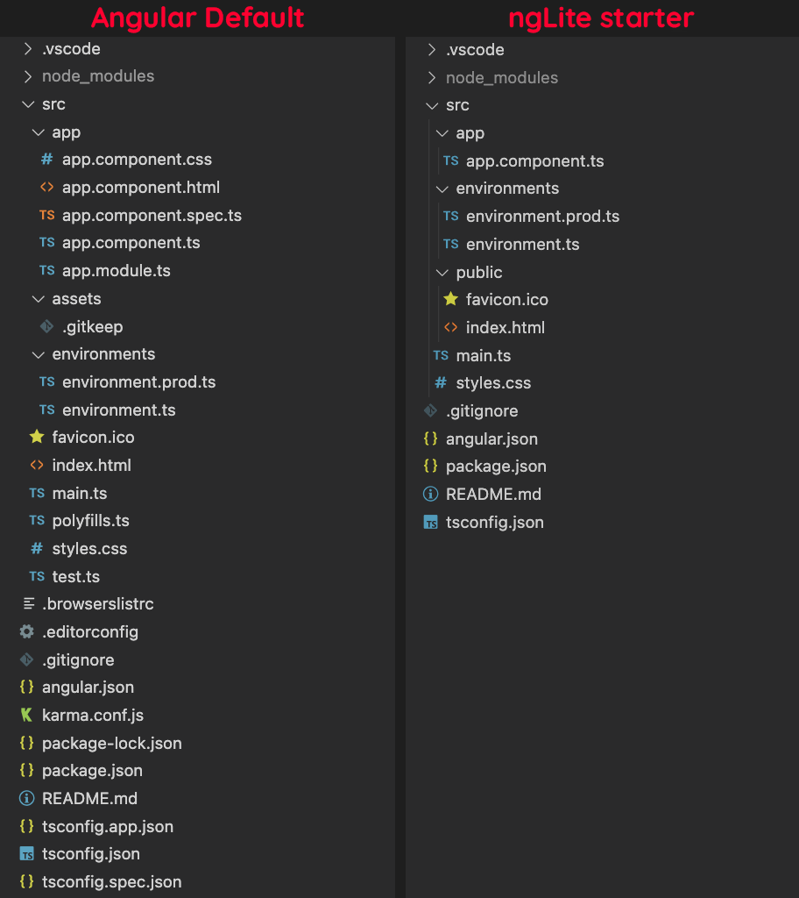

A lot of complaints I heard when starting with Angular are about the sheer amount of files you get even on simple apps. When looking at the default starter template you get from Angular CLI's `ng new` command, it's true that it can be a bit overwhelming if you're not used to it.

But it doesn't have to *always* be that way. In this article, we'll explore how we can a smaller and simpler template that's also easier to grasp for beginners, following the [YAGNI principle](https://en.wikipedia.org/wiki/You_aren%27t_gonna_need_it).

## Getting prepared

Make sure you have a recent [Node.js](https://nodejs.org) runtime installed (at least v14), and let's start by installing the [Angular CLI](https://cli.angular.io).

```bash
npm install -g @angular/cli
```

This command-line tool is used to initialize new projects, among other things. After installing, you usually use it to create a new Angular project with the `ng new` command, but hold off a bit!

If you're old enough, maybe you remember using [nLite](https://en.wikipedia.org/wiki/Software_remastering#nLite) to slim down your Windows install, back in the days? We'll take a similar approach here with the Angular starter to create an "ngLite" template, making sure to keep the amount of files to a minimum..

> **Note:** In the following sections, we'll take some time to understand the base application template and how it can be slimmed down for simpler projects. If you want to skip directly to the end result, you can use the command `npx degit sinedied/ng-lite-starter my-app` that will use this pre-made [github template](https://github.com/sinedied/ng-lite-starter), but you'll miss all the fun 😉.

## Slimming down the starter template


Let's create our app with this (long) command:

```bash
ng new ng-lite --minimal --inline-template --inline-style --routing=false --style=css
```

Let's explain the options we used here:
- `--minimal`: creates a minimal project, without any test tools. When we'll get there, we'll probably want to use a better test framework than the default one anyways.
- `--inline-template` and `--inline-style`: enables single file components (SFC), including the HTML template and CSS styling directly into your TypeScript components. Instead of 3 files per component, you'll get only one.
- `--routing=false`: disables the default routing system. We can always add it back later if needed.
- `--style=css`: use standard CSS styling for our components. If you prefer other flavours like SCSS, you can adapt this option to suit your needs.

After the files are generated and the dependencies installed, let's hop into the `ng-lite` folder and start with some cleaning, removing dependencies we don't need.

```bash
cd ng-lite

# Remove the dependencies we don't need
# It's not because it's part of the framework that we have to use it :)
npm rm @angular/animations @angular/forms @angular/router @angular/platform-browser-dynamic
```

Now let's have a look at all the files we have:

```
.vscode/
|- extensions.json
|- launch.json
|- tasks.json
src/
|- app/
| |- app.component.ts
| |- app.module.ts
|- assets/
| |- .gitkeep
|- environments/
| |- environment.prod.ts
| |- environment.ts
|- favicon.ico
|- index.html
|- main.ts
|- polyfills.ts
|- styles.css
.browserslistrc
.gitignore
angular.json
package.json
README.md
tsconfig.app.json
tsconfig.json
```

The `.vscode` folder contains configurations related to the [Visual Studio Code](https://aka.ms/vs/code) editor. It provides tasks to debug your app when pressing `F5` key, and suggests you to install the must-have [Angular language service extensions](https://marketplace.visualstudio.com/items?itemName=angular.ng-template&WT.mc_id=javascript-0000-yolasors) when you open the project. If you don't use VS Code though, you can remove this folder.

Next, we'll slim down a bit the number of files at the root of the project. You can see two `tsconfig.json` files there, used for [TypeScript](https://www.typescriptlang.org) configuration. This separation may be useful when you want to use a different configuration for your tests, which is the case for the default setup created by `ng new`, but we don't need it here. Add these lines coming from `tsconfig.app.json` at the bottom of the `tsconfig.json` file:

```json
  "files": [
    "src/main.ts"
  ],
  "include": [
    "src/**/*.d.ts"
  ]
```

And remove `tsconfig.app.json`:

```bash
rm tsconfig.app.json
```

We'll need to change a bit the `angular.json` file before your app can build again, but let's keep that for later.

Now, there's another file that we can get rid of: `.browserslistrc`. It's a file that tells which browsers you want to support, and the Angular build system will adjust the CSS and JS output accordingly. Instead of having a separate file for that, you can add this entry at the end of the `package.json` file:

```json
  "browserslist": [
    "last 1 Chrome version",
    "last 1 Firefox version",
    "last 2 Edge major versions",
    "last 2 Safari major versions",
    "last 2 iOS major versions",
    "Firefox ESR"
  ]
```

Then you can remove the `.browserslistrc` file.

```bash
rm .browserslistrc
```

### Reworking the `src/` folder

In the `src/` folder, you'll find a file named `polyfills.ts` that may contains polyfills, small pieces of code used to provide a compatibility layer for newer features. If you're targetting recent browsers, you can get rid of this file and just add the `zone.js` import at the top of `main.ts`:

```typescript
// Add this at the top of main.ts
import 'zone.js';
```

Then, remove `polyfills.ts`:

```bash
rm src/polyfills.ts
```

Now, there's a folder named `assets/` that you can use to put any assets (images, fonts, JSON files...) you want to be copied to the `dist/` folder. It contains an empty `.gitkeep` to get the folder stored in the git repo, as git don't store empty folders. We can simplify this structure a bit, by also grouping our future assets with the base `index.html` and favicon file:

```bash
# Removes assets/ folder
rm -rf src/assets
# Creates a public/ folder instead
mkdir src/public
# Moves index.html and favicon.ico files into it
mv src/index.html src/favicon.ico src/public
```

This doesn't change much, but it's more in-line with what you can find in almost all other web frameworks (React, Vue, Svelte...) and it means that you can easily add any new files to be placed at the root of the `dist/` folder without having to edit `angular.json` every time, something we'll have to do once a bit later.

The next change we'll do here is get rid of `src/app/app.module.ts`. Starting with Angular 14, we can create apps using [only components](https://angular.io/guide/standalone-components) and that's perfect as it's all we need to get started.

> Keep in mind that Angular Standalone components are still in preview, so the API may still change in the future.

```bash
# Removes app.module.ts file
rm src/app/app.module.ts
```

Edit the file `src/app/app.component.ts`, our entry component, and add `standalone: true` at the top of the component properties:

```typescript
@Component({
  // Add the line below
  standalone: true,
  ...
```

We'll finally update the entry point of the application located at `src/main.ts`, to bootstap our app using our component. Replace the content of the file with this:

```typescript
import 'zone.js';
import { enableProdMode } from '@angular/core';
import { bootstrapApplication } from '@angular/platform-browser';

import { AppComponent } from './app/app.component';
import { environment } from './environments/environment';

if (environment.production) {
  enableProdMode();
}

bootstrapApplication(AppComponent)
  .catch(err => console.error(err));
```

We'll keep the rest of the files as-is as they will be useful for our app:
- `src/styles.css` is the global stylesheet for the app. You can use it to import any CSS lib you want to use, and put your global styling here.
- `src/environments/environment*.ts` these files contains the environment configuration for the app. `environment.ts` will be used during development, and `environment.prod.ts` will replace it during production builds so it's an easy way to define any environment-specific settings, like your API URL.

### Editing `angular.json`

The `angular.json` file is the (rather verbose) configuration file that tells the Angular CLI how to run your project's tasks, such as building your app. Since we changed a few things from the default app structure, our final step it to update this file to reflect our changes.

1. Replace the line `"tsConfig": "tsconfig.app.json",` with `"tsConfig": "tsconfig.json",`

2. Remove the line `"polyfills": "src/polyfills.ts",`

3. Replace the line `"index": "src/index.html",` with `"index": "src/public/index.html",`

4. Replace this:
    ```json
    "assets": [
      "src/favicon.ico",
      "src/assets"
    ],
    ```
    with:
    ```json
    "assets": [
      {
        "glob": "**/*",
        "input": "src/public",
        "output": "."
      }
    ],
    ```

5. Finally, add the line `"standalone": true,` under the `"@schematics/angular:component"` key, as we'll use standalone component in our app:
    ```json
    // ...
    "@schematics/angular:component": {
      "standalone": true,
      // ...
    }
    ```

Wheew! That's a lot of changes, but we managed to simplify our starter template by quite a lot while still retaining essential Angular features. Look at this screenshot:



Also, a nice side effect of this work is the reduction of the initial bunldle size, from a 150.91 kB total (46.20 kB gzipped) with the default `ng new` template to a 116.01 kB total (36.15 kB gzipped) with our starter.

Of course, that's a bit tedious and not something you want to do everytime you start a new project! You can use this [github template](https://github.com/sinedied/ng-lite-starter) if you'd like to use this starter again in the future, or you can make your own.

## What about testing?

You may have noticed that this template doesn't include any testing tools. That may be fine for learning and personal projects, but it's not a good idea for a production app to skip on unit testing.

While the default Angular starter includes unit tests, it makes use of the older and clunky [Karma](https://karma-runner.github.io)/[Jasmine](https://jasmine.github.io) combo for unit testing.

When you need units testing for your project, you can use the much better and faster testing framework [Jest](https://jestjs.io) with our `ngLite` template by adding a few extra steps:

1. Run the command `npm install --save-dev jest @angular-builders/jest @types/jest` to install the dependencies.

2. Add a `jest.config.js` file to your project root with the following content:
    ```js
    module.exports = {
      clearMocks: true,
      collectCoverage: true,
      coverageDirectory: "coverage",
    };
    ```

3. Add a `tsconfig.spec.json` file to your project root with the following content:
    ```json
    {
      "extends": "./tsconfig.json",
      "compilerOptions": {
        "outDir": "./out-tsc/spec",
        "types": ["jest"],
        "esModuleInterop": true
      },
      "include": [
        "src/**/*.spec.ts",
        "src/**/*.d.ts"
      ]
    }
    ```

4. In your `angular.json` file, add this after your `serve` configuration (under the `architect` key):
    ```json
    "test": {
      "builder": "@angular-builders/jest:run",
      "options": {
        "tsConfig": "tsconfig.spec.json"
      }
    },
    ```
    If you want to have tests generated by default when using the `ng generate` command, you can also remove all the `"skipTests": true` occurences in this file.

5. Create your first test in `src/app/app.component.spec.ts`:
    ```typescript
    import { ComponentFixture, TestBed } from '@angular/core/testing';
    import { AppComponent } from './app.component'; 

    describe('AppComponent', () => {
      let component: AppComponent;
      let fixture: ComponentFixture<AppComponent>;

      beforeEach(async () => {
        await TestBed.configureTestingModule({
          imports: [AppComponent],
        }).compileComponents();

        fixture = TestBed.createComponent(AppComponent);
        component = fixture.componentInstance;
        fixture.detectChanges();
      });

      it('should create the component', () => {
        expect(component).toBeTruthy();
      });
    });
    ```

You can now run your tests with `ng test` or `ng test --watch`.

## What's next?

If you followed closely, you've seen that we didn't even include some Angular's core libraries like `@angular/forms` or `@angular/router`. Well, that's not because you're writing an Angular app that you have to use *all* of the provided libraries! For sure they're convenient, and you can always add them back later if you need it, but you can also build your entire app *without them*.

That's what we'll explore in a further article, now that we have a simpler starter template, why not try building a complete app, keeping things lean?

---

Follow me on [Twitter](http://twitter.com/sinedied), I would be happy to discuss and take your suggestions!
