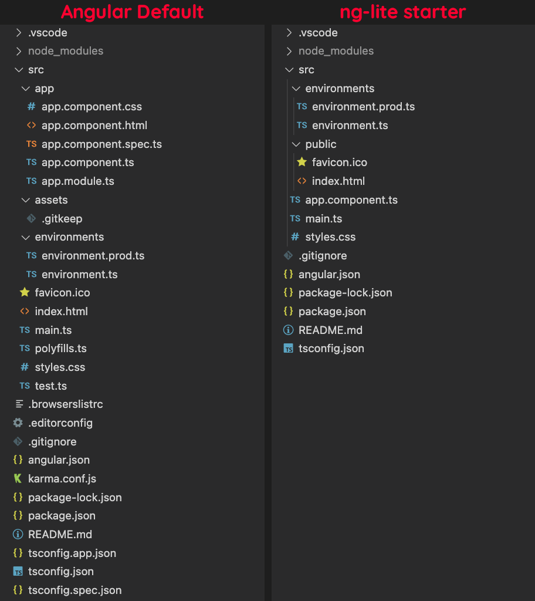

Being a rather complete framework, Angular is often said to be complex and difficult to learn. And seeing a lot of articles telling that you need to learn RxJS and observables before even starting to dig in Angular isn't really helping with that idea.

Sure, there's a lot of Angular built-in features and tools that you can use to make your life easier when dealing with complex applications, but you don't have to learn all of them to get started. In fact, you can build perfectly fine apps using mostly HTML/CSS and Angular components, without using any other features.

Let's try building the infamous todo list app while learning the basics of Angular and keeping the project as simple as it can be, following the [YAGNI principle](https://en.wikipedia.org/wiki/You_aren%27t_gonna_need_it).

## Getting prepared

Make sure you have a recent [Node.js](https://nodejs.org) runtime installed, and let start by installing the [Angular CLI](https://cli.angular.io).

```bash
npm install -g @angular/cli
```

This command-line tool is used to initialize, develop, build and even update Angular projects. This is basically your best friend when working with Angular.

## Bootstrapping the app

After installing the CLI, you use it to create a new Angular project with the `ng new` command, but hold off a bit. A lot of complaints I heard when starting with Angular are about the sheer amount of files you get even on simple apps, so we'll make sure to keep that amount to a minimum.

If you're old enough, maybe you remember using [nLite](https://en.wikipedia.org/wiki/Software_remastering#nLite) to slim down your Windows install back in the days? We'll take a similar approach here with the Angular starter to create an "ng-lite" template.

> **Note:** In the following section, we'll take some time to understand the base application template and how it can be slimmed down for simpler projects. If you're not interested in that part, you can instead use the command `npx degit sinedied/ng-lite-starter ng-lite-todo` that will use this pre-made [github template](https://github.com/sinedied/ng-lite-starter) and jump to the [next section](#building-the-todo-list).

### Slimming down the starter template

Let's create our app with this (long) command:

```bash
ng new ng-lite-todo --minimal --inline-template --inline-style --routing=false --style=css
```

Let's explain the options we used here:
- `--minimal`: creates a project without any test tools. When we'll get there, we'll probably want to use a better test framework than the default one anyways.
- `--inline-template` and `--inline-style`: enables single file components (SFC), including the HTML template and CSS styling directly into your TypeScript components. Instead of 3 files (4 with tests) per component, you'll get only one.
- `--routing=false`: disables the default routing system. We'll use our own router later on.
- `--style=css`: use standard CSS styling for our components.

After the files are generated and the dependencies installed, let's hop into the `ng-lite-todo` folder and start with some cleaning, removing dependencies we don't need.

```bash
cd ng-lite-todo

# Remove the dependencies we don't need
# It's not because it's part of the framework that we have to use it!
npm rm @angular/animations @angular/forms @angular/router @angular/platform-browser-dynamic
```

Now let's have a look at all the files we have:

```
.vscode/
|- extensions.json
|- launch.json
|- tasks.json
src/
|- app/
| |- app.component.ts
| |- app.module.ts
|- assets/
| |- .gitkeep
|- environments/
| |- environment.prod.ts
| |- environment.ts
|- favicon.ico
|- index.html
|- main.ts
|- polyfills.ts
|- styles.css
.browserslistrc
.gitignore
angular.json
package.json
README.md
tsconfig.app.json
tsconfig.json
```

The `.vscode` folder contains configurations related to the [Visual Studio Code](https://aka.ms/vs/code) editor. It provides tasks to debug your app when pressing `F5` key, and suggests you to install the must-have [Angular language service extensions](https://marketplace.visualstudio.com/items?itemName=angular.ng-template&WT.mc_id=javascript-0000-yolasors) when you open the project. If you don't use VS Code though, you can remove this folder.

Next, we'll slim down a bit the number of files at the root of the project. You can see two `tsconfig.json` files there, used for [TypeScript](https://www.typescriptlang.org) configuration. This separation may be useful when you want to use a different configuration for your tests, which is the case for the default setup created by `ng new`, but we don't need it here. Add these lines coming from `tsconfig.app.json` at the bottom of the `tsconfig.json` file:

```json
  "files": [
    "src/main.ts"
  ],
  "include": [
    "src/**/*.d.ts"
  ]
```

And remove `tsconfig.app.json`:

```bash
rm tsconfig.app.json
```

We'll need to change a bit the `angular.json` file before your app can build again, but let's keep that for later.

Now, there's another file that we can get rid of: `.browserslistrc`. It's a file that tells which browsers you want to support, and the Angular build system will adjust the CSS and JS output accordingly. Instead of having a separate file for that, you can add this entry at the end of the `package.json` file:

```json
  "browserslist": [
    "last 1 Chrome version",
    "last 1 Firefox version",
    "last 2 Edge major versions",
    "last 2 Safari major versions",
    "last 2 iOS major versions",
    "Firefox ESR"
  ]
```

Then you can remove the `.browserslistrc` file.

```bash
rm .browserslistrc
```

#### Reworking the `src/` folder

In the `src/` folder, you'll find a file named `polyfills.ts` that may contains polyfills, small pieces of code used to provide a compatibility layer for newer features. If you're targetting recent browsers, you can get rid of this file and just add the `zone.js` import at the top of `main.ts`:

```typescript
// Add this at the top of main.ts
import 'zone.js';
```

Then, remove `polyfills.ts`:

```bash
rm src/polyfills.ts
```

Now, there's a folder named `assets/` that you can use to put any assets (images, fonts, JSON files...) you want to be copied to the `dist/` folder. It contains an empty `.gitkeep` to get the folder stored in the git repo, as git don't store empty folders. We can simplify this structure a bit, by also grouping our future assets with the base `index.html` and favicon file:

```bash
# Removes assets/ folder
rm -rf src/assets
# Creates a public/ folder instead
mkdir src/public
# Moves index.html and favicon.ico files into it
mv src/index.html src/favicon.ico src/public
```

This doesn't change much, but it's more in-line with what you can find in almost all other web frameworks (React, Vue, Svelte...) and it means that you can easily add any new files to be placed at the root of the `dist/` folder without having to edit `angular.json` every time, something we'll have to do once a bit later.

The next change we'll do here is get rid of `src/app/app.module.ts`. Starting with Angular 14, we can create apps using [only components](https://angular.io/guide/standalone-components) and that's perfect as it's all we need.

> Keep in mind that Angular Standalone components are still in preview, so its API may still change in the future.

```bash
# Removes app.module.ts file
rm src/app/app.module.ts
```

Edit the file `src/app/app.component.ts`, our entry component, and add `standalone: true` at the top of the component properties:

```typescript
@Component({
  // Add the line below
  standalone: true,
  ...
```

We'll finally update the entry point of the application located at `src/main.ts`, to bootstap our app using our component. Replace the content of the file with this:

```typescript
import 'zone.js';
import { enableProdMode } from '@angular/core';
import { bootstrapApplication } from '@angular/platform-browser';

import { AppComponent } from './app/app.component';
import { environment } from './environments/environment';

if (environment.production) {
  enableProdMode();
}

bootstrapApplication(AppComponent)
  .catch(err => console.error(err));
```

We'll keep the rest of the files as-is as they will be useful for our app:
- `src/styles.css` is the global stylesheet for the app. You can use it to import any CSS lib you want to use, and put your global styling here.
- `src/environments/environment*.ts` these files contains the environment configuration for the app. `environment.ts` will be used during development, and `environment.prod.ts` will replace it during production builds so it's an easy way to define any environment-specific settings, like your API URL.

#### Editing `angular.json`

The `angular.json` file is the (rather verbose) configuration file that tells the Angular CLI how to run your project's tasks, such as building your app. Since we changed a few things from the default app structure, our final step it to update this file to reflect our changes.

1. Replace the line `"tsConfig": "tsconfig.app.json",` with `"tsConfig": "tsconfig.json",`
2. Remove the line `"polyfills": "src/polyfills.ts",`
3. Replace the line `"index": "src/index.html",` with `"index": "src/public/index.html",`
4. Replace
  ```json
  "assets": [
    "src/favicon.ico",
    "src/assets"
  ],
  ```
  with
  ```json
  "assets": [
    {
      "glob": "**/*",
      "input": "src/public",
      "output": "."
    }
  ],
  ```
5. Finally, add the line `"standalone": true,` under the `"@schematics/angular:component"` key, as we'll use standalone component in our app:
  ```json
  // ...
  "@schematics/angular:component": {
    "standalone": true,
    // ...
  }
  ```

Wheew! That's a lot of changes, but we managed to simplify our starter template by quite a lot while still retaining essential Angular features. Look at this screenshot:



Also, a nice side effect of this work is the reduction of the initial bunldle size, from a 150.74 kB total (46.16 kB gzipped) with the default `ng new` template to a 115.52 kB total (13.5 kB gzipped) with our starter.

Of course, that's a bit tedious and not something you want to do everytime you start a new project! You can use this [github template](https://github.com/sinedied/ng-lite-starter) if you'd like to use this starter again in the future.

## Building the todo list

Let's focus now on building our todo list app. The feature set we'll implement is rather classic, but will allow us to have a look at all the learning fundamentals: 

- Creating container and presentational components
- Passing data between components
- Showing/hiding content dynamically
- Creating forms and handling form data
- Displaying a keyed list
- Handling app routing
- Calling an API

Time to get started!

### Creating the task list component

We'll start by creating a component that will display the list of tasks. Run the command:

```bash
ng g component task-list --flat
```

This will create the new file `src/app/task-list.component.ts`. The `--flat` option indicates that we don't need an extra folder for the component.

You'll notice an error on your newly created component, what?!


Don't mind it, this is a good reminder that currently this component isn't used anywhere, so we need to fix that.

In the file `src/app/app.component.ts`, import our new component at the top:

```typescript
import { TaskListComponent } from './task-list.component';
```

And add this line to the `@Component` properties:

```typescript
@Component({
  imports: [TaskListComponent],
  // ...
})
```

Because we're using Angular [standalone components](https://angular.io/guide/standalone-components) in this project, we need to explicitely imports the components and Angular features we want to use in every component of our app.

#### What

Now let's move back to `src/app/task-list.component.ts` and take a moment to look at how a component is defined with Angular:

```typescript
@Component({
  selector: 'app-task-list',
  standalone: true,
  imports: [CommonModule],
  template: `
    <p>
      task-list works!
    </p>
  `,
  styles: [
  ]
})
export class TaskListComponent implements OnInit {

  constructor() { }

  ngOnInit(): void {
  }

}
```


- all / active / completed route filter
- todoItem
- todoService


### Your next learning steps

- Angular router
- Angular forms
- Angular services and dependency injection
- Angular HTTP service
- Reactives forms and observables
- Angular animations
- Angular modules
- Angular service worker
- ...