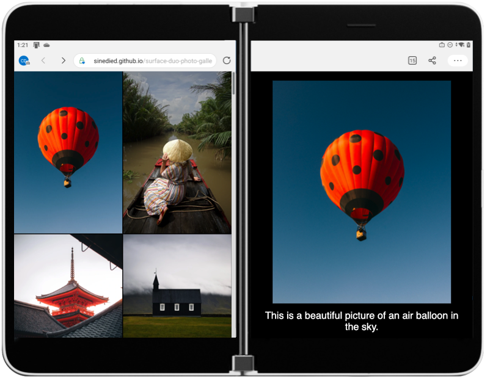

Foldable and dual-screen devices are becoming increasingly more common over time, but you may wonder if investing development time to support these devices might be worth it, especially when creating fully responsive web apps is already a challenge. Using the new [CSS and JavaScript primitives](https://devblogs.microsoft.com/surface-duo/dual-screen-web-experiences-preview/?WT.mc_id=javascript-12159-yolasors) is a fun way to discover and learn about the new possibilities offered by devices like the Surface Duo, yet you might be looking for a more efficient way to adapt existing apps without having to make drastic changes and dive too much into custom CSS. That's what we're going to explore here.

In this post we'll take a look at how you can use [Angular](https://angular.io/) to create a foldable web experience, with minimal changes to an existing code base. We'll start from the [photo gallery demo](https://github.com/foldable-devices/demos/tree/master/photo-gallery), create an Angular version of it and then see how using an Angular library makes the foldable adaptation way easier to approach.


## TL;DR key takeaway

Adapting existing apps to foldable devices does not mean that you have to rethink your design and code entirely. With [ngx-foldable](https://github.com/sinedied/ngx-foldable) library you can adapt existing Angular apps to support dual-screen devices with minimal changes to your app (and no CSS!). [react-foldable](https://github.com/aaronpowell/react-foldable) is also an alternative if you're working with React, and I'm sure that similar libraries will eventually become available for other frameworks.

## Re-creating the Photo Gallery demo with Angular

I wanted to keep the demo app as simple as possible to understand, so I used the [Angular CLI](https://cli.angular.io/) to generate the project using the minimal template:

```bash
ng new photo-gallery --minimal --prefix=pg --style=css --routing=false --strict
```

It gives us a nice working base with [strict type checking](https://www.typescriptlang.org/tsconfig#strict) and single file components, which looked perfect for building this demo. I won't cover here all the details about what I did to recreate the demo, as I mostly took the existing JavaScript and CSS code from the original photo gallery app and put it in Angular components.

You can find the complete application [source code on GitHub](https://github.com/sinedied/surface-duo-photo-gallery), but let's have a closer look at the most interesting parts here.

# App component

The file `app.component.ts` is the root component of our application. It contains the state, as which image is currently selected, and all the components composing our app. By looking at its template you can glimpse at how our appplication works:

```html
<pg-gallery [images]="images" (select)="setImage($event)"></pg-gallery>
<pg-fold></pg-fold>
<pg-details [image]="currentImage"></pg-details>
<pg-fullview
  [image]="currentImage"
  (close)="closeImage()"
  (previous)="previousImage($event)"
  (next)="nextImage($event)"
></pg-fullview>
```

From there you can see that our app is made of 4 main components:
- **Gallery**: a scrollable list of thumbnails
- **Fold**: a placeholder for the space taken by the fold area on dual-screen devices
- **Details**: show the zoomed in version of the selected image with its description on dual-screen devices
- **Fullview**: show the selected image in full screen on single-screen devices

The **App** component also includes some styling to lay out these components depending of the device configuration:

```css
:host {
  width: 100vw;
  height: 100vh;
  display: flex;
  flex-direction: row;
}

@media (screen-spanning: single-fold-vertical) {
  :host { flex-direction: row; }
}

@media (screen-spanning: single-fold-horizontal) {
  :host { flex-direction: column-reverse; }
}

@media (screen-spanning: none) {
  :host { flex-direction: row; }
}
```

Here we're using specific media queries to adapt the layout on a dual-screen configuration. You'll see these media queries also used in the other components to hide or show them and adapt their design for every configuration, so let's have a closer look.

## Fold, Details and Fullview components

These three components are used to display differens things depending on what device it's running on. The **Fullscreen** component is used only on single-screen devices, whereas the **Fold** and **Details** components are used on dual-screen devices.

```typescript
import { Component } from '@angular/core';

@Component({
  selector: 'pg-fold',
  template: `<div class="fold"></div>`,
  styles: [
    `
      .fold {
        height: 0;
        width: 0;
        background-size: 40px 40px;
        background-color: #737373;
        background-image: linear-gradient(
          45deg,
          rgba(255, 255, 255, 0.2) 25%,
          transparent 25%,
          transparent 50%,
          rgba(255, 255, 255, 0.2) 50%,
          rgba(255, 255, 255, 0.2) 75%,
          transparent 75%,
          transparent
        );
      }

      @media (screen-spanning: single-fold-vertical) {
        .fold {
          height: env(fold-height);
          width: env(fold-width);
        }
      }

      @media (screen-spanning: single-fold-horizontal) {
        .fold {
          height: env(fold-height);
          width: env(fold-width);
        }
      }
    `,
  ],
})
export class FoldComponent {}
```

You can see here that by default the **Fold** component is hidden (height and width set to 0) and it's made visible with different sizes when a dual-screen device is used. The **Details** component uses a similar approach. The **Fullview** component does the opposite by hiding itself when a dual-screen device is detected, with this media query:

```css
@media (screen-spanning: single-fold-horizontal),
       (screen-spanning: single-fold-vertical) {
  .container {
    display: none;
  }
}
```

With that, we've covered the main principles behind the orginal photo gallery adaptation. You can see the full source code for this version [here](https://github.com/sinedied/surface-duo-photo-gallery/tree/css).

But we've not really made good usage of Angular features here, as we are including all components whether they're needed or not, and use CSS to show or hide them. We also had to use extra CSS with specific media queries, meaning more work was needed to make this demo. It might not be an issue here as our demo remains quite simple, but in more complex applications, this could result in reduced performance due to unnecessary component rendering, and maintenance issues due to the scattered CSS approach.

## Introducing ngx-foldable

The Angular library [ngx-foldable](https://www.npmjs.com/package/ngx-foldable) was specifically designed to allow adapting Angular applications while making minimal changes to your code. It provides directives and services to access the screen context information and react to changes automatically.

We install it with `npm install ngx-foldable` and then import the `FoldableModule` into our app:

```typescript
import { FoldableModule } from 'ngx-foldable';

@NgModule({
  imports: [
    FoldableModule
    ...
  ],
  ...
})
export class AppModule {}
```

## Revisiting the App component

With the library set up, we can now use the provided `fdSplitLayout`, `fdWindow` and `fdIfSpan` directives to rebuild our App component template:

```html
<div fdSplitLayout="flex reverse">
  <pg-gallery fdWindow="0" [images]="images" (select)="setImage($event)"></pg-gallery>
  <pg-details fdWindow="1" *fdIfSpan="'multi'" [image]="currentImage"></pg-details>
  <pg-fullview
    *fdIfSpan="'none'"
    [image]="currentImage"
    (close)="closeImage()"
    (previous)="previousImage($event)"
    (next)="nextImage($event)"
  ></pg-fullview>
</div>
```

First, you'll notice that we added a top `<div>` container with the directive `fdSplitLayout`. This directive enables us to build a split layout on dual-screen devices without the need for extra CSS. The first parameter allow to choose which kind of CSS layout you want to use, so we're using `flex` here.  Other possible options are `grid` or `absolute`, to better fit your existing app layout. The second parameter allows you to choose whether you want to `reverse` the window segments order when the spanning (ie the orientation) changes, or keep the `normal` order.


Next you'll notice that we added the `fdWindow` directive to the **Gallery** and **Details** components. This one allows you to assign a particular component to a window segment in dual-screen mode, and works only within a `fdSplitLayout` container element.

The best part of the `fdSplitLayout` and `fdWindow` directives are that they're only activated on dual-screen devices, so absolutely no CSS is added when the app is running on a single screen device.

Notice that we also got rid of the **Fold** component, as it's no longer needed.

Finally, we used the `fdIfSpan` structural directive to show/hide the **Details** and **Fullview** components depending on the context. This directive works the same as [`ngIf`](https://angular.io/api/common/NgIf), except that it's wired to pre-defined conditions related to the current screen context.

`*fdIfSpan="'multi'"` means that the **Details** component will only be attached to the DOM in a multi-screen context, no matter what the orientation of the device is. The **Fullview** component uses the opposite value `'none'`, meaning that it will be present only on single-screen devices. Note that we could have also used the [`else`](https://angular.io/api/common/NgIf#showing-an-alternative-template-using-else) syntax, exactly like a regular `ngIf`.

Other possible conditions are `'fold-vertical'` and `'fold-horizontal'`, if you need to target a specific orientation.

Using these three directives, we can now remove ALL the specific CSS related to single/dual screen adaptation. Yup, you read that right. With that, the new CSS for our App component simply becomes:

```css
:host {
  width: 100vw;
  height: 100vh;
}
```

Less code in the end, better performance and no need for specific CSS, sounds like a win here? 🙂

You can see the final web app [here](https://sinedied.github.io/surface-duo-photo-gallery/).



## Going further

We've seen how we can abstract the handling of device adaptation and provide a higher-level API using Angular. While it's always interesting to have a look at the [CSS primitives](https://github.com/MicrosoftEdge/MSEdgeExplainers/blob/main/Foldables/explainer.md#proposal-css-primitives-for-building-dual-screen-layouts) behind it, sometimes we just want a more straightforward way of achieving our intent. That's also why CSS libraries like [Bootstrap](https://getbootstrap.com/) and [Tailwind CSS](https://tailwindcss.com/) are so popular for quickly creating Responsive Designs.

You can take a look at the app [final code](https://github.com/sinedied/surface-duo-photo-gallery) and the details of [the changes](https://github.com/sinedied/surface-duo-photo-gallery/compare/css...main) when using the ngx-foldable library.

If you're curious, you can also dive into the code behind  [ngx-foldable](https://github.com/sinedied/ngx-foldable) and see how it works. Contributions are welcomed too 😉.

---

Follow me on [Twitter](http://twitter.com/sinedied), I would be happy to discuss and take your suggestions!
