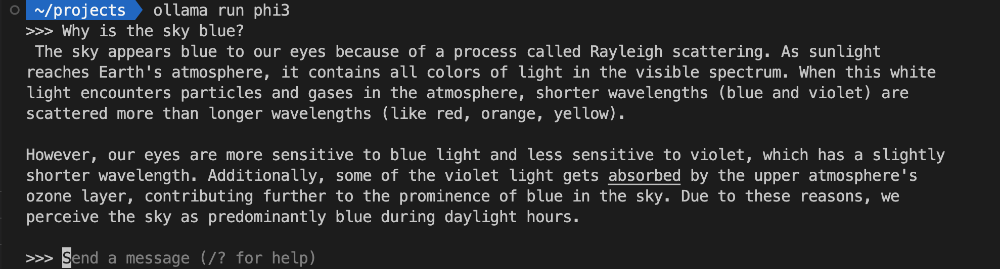
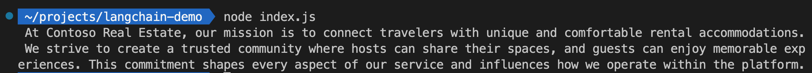

The generative AI landscape moves at a fast pace, and it can be challenging to keep up with the latest developments, even for seasoned developers. There are in particular two questions that often come up when starting a new AI project:

- *How can I quickly validate an AI app idea, without investing too much time and resources?*
- *If I have a working prototype, how fast can I scale it to production?*

You don't want to be outpaced by competitors or newer technologies, and you want to be able to quickly iterate on your ideas or pivot to new ones. This is where LangChain.js comes in. It's a framework that allows you to build AI applications very little adherence to the underlying AI technologies and tools. It abstracts some of the complexity of AI development, allowing you to focus on the business logic of your application.

In this article, we'll take you through the development journey, starting from an idea and progressing towards production. We'll explore how LangChain framework together with Azure AI building blocks allows you to quickly build complex AI applications at the various stages of development.

> **Note:** If you prefer to watch a video version of this article, you can find it [on YouTube here](https://www.youtube.com/watch?v=L4T4_Z1kyao).

## TL;DR key takeaways

- AI is not only reserved to Python developers: JavaScript developers also have everything they need to build AI applications.
- LangChain.js provides useful abstraction over AI models and APIs, allowing you to switch between them easily. This is particularly useful when you're experimenting with different models or when you want to scale your application, moving from a local SLM model to a cloud-based LLM.
- Ollama is allow you to experiment with AI models and embeddings locally, at no cost (if you have a powerful enough machine).
- Azure provides many AI building blocks and services that you can use to scale your application to production.

Here's the [source code on GitHub](https://github.com/Azure-Samples/serverless-chat-langchainjs) of the project we use as an example in this article.

If you like the project, don't forget to give it a star ⭐️!

## Working locally with Ollama

[Ollama](https://ollama.com/) is a command-line tool that allows you to run AI models locally on your machine, making it great for prototyping. Running 7B/8B models on your machine requires at least 8GB of RAM, but works best with 16GB or more. You can install Ollama on Windows, macOS, and Linux from the official website: https://ollama.com/download.

Once you have Ollama installed, let's first download some models. You can find a list of available models on the [Ollama website](https://ollama.com/models). For this example, we'll use the [Phi-3 Mini](https://ollama.com/library/phi3:mini) model. Open a terminal and run the following command:

```bash
ollama pull phi3
```

> **Note:** This will download a few gigabytes of data, so make sure you have enough space on your machine and a good internet connection.

Once the model is downloaded, you can start interacting with the Ollama server. For example, you can use the `ollama run` command to generate text based on a prompt:

```bash
ollama run phi3 "What is artificial intelligence? Explain it to a 5 years old child."
```

You can also have a minimal ChatGPT-like experience right from you terminal by just running:

```bash
ollama run phi3
```



You can then chat with the model interactively. Once you're done, you can stop the server by pressing `Ctrl+D`.
Ollama also provides a REST API that you can use to interact with the model. The API provides [many options](https://github.com/ollama/ollama/blob/main/docs/api.md), like streaming, JSON mode, and more. Here's an example of how you can use the API:

```bash
curl http://localhost:11434/api/generate -d '{
  "model": "phi3",
  "prompt": "What is artificial intelligence? Explain it to a 5 years old child.",
  "stream": false
}'
```

After running this command you should see a JSON response from the model
Ollama even provides an OpenAI compatible API, so you can use it as drop-in replacement for OpenAI models in your applications. And as Ollama runs entirely on your machine, it means you don't even need a network connection to use it.

While Ollama is great for experimentation and prototyping, keep in mind that smaller models are not as powerful as the larger models available in the cloud. While it might be enough to validate your idea, you'll probably want to switch to cloud-based models for production to get better results.

## Prototyping with LangChain.js

Now that we know how to run AI models locally, let's see how we can use LangChain.js to quickly prototype an AI application. [LangChain.js](https://js.langchain.com/) is a JavaScript framework that provides a high-level API to interact with AI models and APIs with many built-in tools to make complex AI applications easier to build.

Let's start with a simple example project from scratch. Open a terminal and run the following commands:

```bash
# Creates a new folder and initializes a new Node.js project
mkdir langchain-demo
cd langchain-demo
npm init es6 -y
npm i langchain @langchain/core @langchain/community pdf-parse faiss-node
touch index.js
```

Now open the `index.js` file in your favorite code editor and add the following code:

```javascript
import { HumanMessage, SystemMessage } from "@langchain/core/messages";
import { ChatOllama } from "@langchain/community/chat_models/ollama";

const model = new ChatOllama({ model: "phi3" });
const response = await model.invoke([
  new SystemMessage("You're a helpful assistant"),
  new HumanMessage("Say hello"),
]);

console.log(response.content);
```

Run the code with `node index.js`. You should see the response from the model in the console. Congrats, you've just built the hello world of AI chatbots!

### A more complex example

What if I want to use [RAG (Retrieval-Augmented Generation)](https://aka.ms/ws?src=gh%3Aazure-samples%2Fazure-openai-rag-workshop%2Fbase%2Fdocs%2F&step=1#what-is-retrievial-augmented-generation) to ground the answers using documents? Let's update our `index.js` file with the following code:

```javascript
import { RecursiveCharacterTextSplitter } from "langchain/text_splitter";
import { createStuffDocumentsChain } from "langchain/chains/combine_documents";
import { createRetrievalChain } from "langchain/chains/retrieval";
import { ChatPromptTemplate } from "@langchain/core/prompts";
import { ChatOllama } from "@langchain/community/chat_models/ollama";
import { OllamaEmbeddings } from "@langchain/community/embeddings/ollama";
import { FaissStore } from "@langchain/community/vectorstores/faiss";
import { PDFLoader } from "@langchain/community/document_loaders/fs/pdf";

// 1. Initialize the models
const model = new ChatOllama({ model: "phi3" });
const embeddings = new OllamaEmbeddings({ model: "all-minilm:l6-v2" });

// 2. Load PDF document and split it into smaller chunks
const loader = new PDFLoader("terms-of-service.pdf", { splitPages: false });
const pdfDocument = await loader.load();
const splitter = new RecursiveCharacterTextSplitter({ chunkSize: 1000, chunkOverlap: 100 });
const documents = await splitter.splitDocuments(pdfDocument);

// 3. Put the documents into a vector store and convert them to vectors
const store = await FaissStore.fromDocuments(documents, embeddings, {});

// 4. Create the RAG chain that retrieves and combines the prompt with the documents
const combineDocsChain = await createStuffDocumentsChain({
  llm: model,
  prompt: ChatPromptTemplate.fromMessages([
    ["system", "You're a helpful assistant"],
    ["human", "Answer the question: {input}\nusing the following documents:\n\n{context}"],
  ]),
});
const chain = await createRetrievalChain({
  retriever: store.asRetriever(),
  combineDocsChain,
});

// 5. Generate the result
const response = await chain.invoke({ input: "What's our mission?" });
console.log(response);
```

This code will load a PDF document, split it into smaller chunks, convert them to vectors, and then use them in a multi-step workflow (chain) to perform a vector search and generate a response using the best results. Pheeew! This one is a more complex example, but it shows how LangChain.js can help you build more advanced AI scenarios in a few lines of code.

Before running this code, you first need to download [this PDF document](https://raw.githubusercontent.com/Azure-Samples/serverless-chat-langchainjs/main/data/terms-of-service.pdf) and put it in the `langchain-demo` folder. 

We also need to download the embeddings model. You can do this by running the following command:

```bash
ollama pull all-minilm:l6-v2
```

This one is very small (~50MB), and helps converting text to vectors. Now you can run your code with:

```bash
node index.js
```



The resulting answer directly comes from the PDF document, you can open it and look at the original mission statement at the beginning of the document to see how the model used it in its response.

Using the same principles as this example, we've prototyped a chatbot for the *Contoso Real Estate company*: we’ve built an experience that allows customers to ask support questions about the usage of its products. You can find the full source code of the project on [GitHub](https://github.com/Azure-Samples/serverless-chat-langchainjs). The final results, with an added chat UI, look like this:


Now that we have a working prototype, let's see how we can deploy it to production using Azure.

## Migrating to Azure

Azure provides many AI services that you can use for your applications, in our case we'll use [Azure OpenAI](https://azure.microsoft.com/products/ai-services/openai-service) for the models and [Azure AI Search](https://azure.microsoft.com/products/ai-services/ai-search) as our vector database. Thanks to LangChain.js abstraction, migrating your prototype to Azure for production is relatively straightforward, as you can swap the models and vector database without changing anything else in your code.

If you look at [the chat API code](https://github.com/Azure-Samples/serverless-chat-langchainjs/blob/main/packages/api/src/functions/chat-post.ts#L54-L75), this is what we use to run the code locally with Ollama:

```typescript
embeddings = new OllamaEmbeddings({ model: ollamaEmbeddingsModel });
model = new ChatOllama({
  temperature: 0.7,
  model: ollamaChatModel,
});
store = await FaissStore.load(faissStoreFolder, embeddings);
```

Switching to Azure OpenAI and Azure AI Search is as simple as changing the model and store initialization:

```typescript
const credentials = getCredentials();

embeddings = new AzureOpenAIEmbeddings({ credentials });
model = new AzureChatOpenAI({
  temperature: 0.7,
  credentials,
});
store = new AzureAISearchVectorStore(embeddings, { credentials });
```

We use passworless authentication for increased security, so we don't need to store any secrets in our code. The implementation of the `getCredentials` was omitted for simplicity, but you can [find it here](https://github.com/Azure-Samples/serverless-chat-langchainjs/blob/main/packages/api/src/security.ts).

And that's it for the migration, at least for the code part, as to make it work you still have to create the necessary resources in Azure. We'll cover this in the next section.

### Azure Developer CLI

As developers, we know infrastructure is no fun, but it's a necessary part of deploying applications to the cloud. Azure provides a tool called [Azure Developer CLI](https://aka.ms/azure-dev/install) that makes it easier to create and manage resources in Azure. It allows you to use [Infrastructure as Code](https://learn.microsoft.com/azure/cloud-adoption-framework/ready/considerations/infrastructure-as-code) to define your resources in a declarative way, and then deploy them with a single command.

We won't cover in details how to build the infrastructure templates, if you're curious though you can have a look at the [`infra` folder](https://github.com/Azure-Samples/serverless-chat-langchainjs/tree/main/infra) and the [`azure.yaml` file](https://github.com/Azure-Samples/serverless-chat-langchainjs/blob/main/azure.yaml) used to configure and deploy the resources.

The good news is that we have many samples that you can use as a starting point for your own project infrastructure. Once the configuration is done, you can create the resources and deploy the application with a few commands:

```bash
# Authenticate to Azure
azd auth login
# Provision and deploy the resources
azd up
```

You can try it with our [Serverless AI Chat project](https://github.com/Azure-Samples/serverless-chat-langchainjs) we used as an example in this article.

## Azure building blocks

We skipped a bit over the implementation details of our example project, but to build it quickly we used some of the already existing Azure AI building blocks. Here's a list of some components we used, that you can reuse in your own projects:

- **OpenAI Node.js SDK**: we announced at Build a new integration of Azure OpenAI with the official [OpenAI Node.js SDK](https://github.com/openai/openai-node?tab=readme-ov-file#microsoft-azure-openai), meaning it's now easier than ever to switch between OpenAI and Azure OpenAI models. The [LangChain.js Azure OpenAI integration](https://js.langchain.com/docs/integrations/chat/azure/) has also been updated to use this new SDK.

- **Azure integrations in LangChain.js**: we've contributed support for many Azure services in LangChain.js, to make it easier to build your AI applications on top of Azure. This includes Azure OpenAI, Azure AI Search, Azure CosmosDB, and more. You can find more information in the [LangChain.js documentation](https://js.langchain.com/docs/integrations/platforms/microsoft).

- **AI Chat protocol**: we've defined an [API schema](https://github.com/microsoft/ai-chat-protocol/tree/main/spec#readme) for AI chat applications, to make the frontend and backend components communicate. This schema is implemented in many of our AI samples, making them interoperable and easy to extend. We also provide an [NPM package](https://www.npmjs.com/package/@microsoft/ai-chat-protocol) that includes the TypeScript types for the data objects and a client library to interact with the API.

- **AI Chat UI components**: if you want to focus on the backend part of your AI chat application, we provide [a set of web components](https://github.com/Azure-Samples/azure-openai-chat-frontend) that implements the AI Chat protocol. You can use them to quickly build a chat UI for your application. And since most of our AI samples also implement the protocol, you can also reuse any of their frontend component if you prefer, like the [one we used in our example project](https://github.com/Azure-Samples/serverless-chat-langchainjs/tree/main/packages/webapp).

## Conclusion

We've covered a lot of ground in this article, starting from running AI models locally with Ollama, to prototyping a chatbot with LangChain.js, and finally deploying it to production on Azure. In a fast-paced environment like AI development, using JavaScript with existing high-level frameworks like LangChain.js and building on top of off-the-shelf building blocks can help you iterate quickly on your ideas and eventually bring them to production.
 you can quickly iterate on your ideas and bring them to production with the right tools and services.

### Reference links

Here are some useful links to get you started with the tools and services we've mentioned in this article:

- [LangChain.js](https://js.langchain.com)
- [Ollama](https://ollama.com/)
- [Azure Developer CLI](https://aka.ms/azure-dev/install)
- [Azure OpenAI Node.js SDK](https://github.com/openai/openai-node?tab=readme-ov-file#microsoft-azure-openai)
- [AI Chat protocol](https://github.com/microsoft/ai-chat-protocol/tree/main/spec#readme)
- [AI Chat UI components](https://github.com/Azure-Samples/azure-openai-chat-frontend)
- [Serverless AI Chat sample](https://github.com/Azure-Samples/serverless-chat-langchainjs/)
