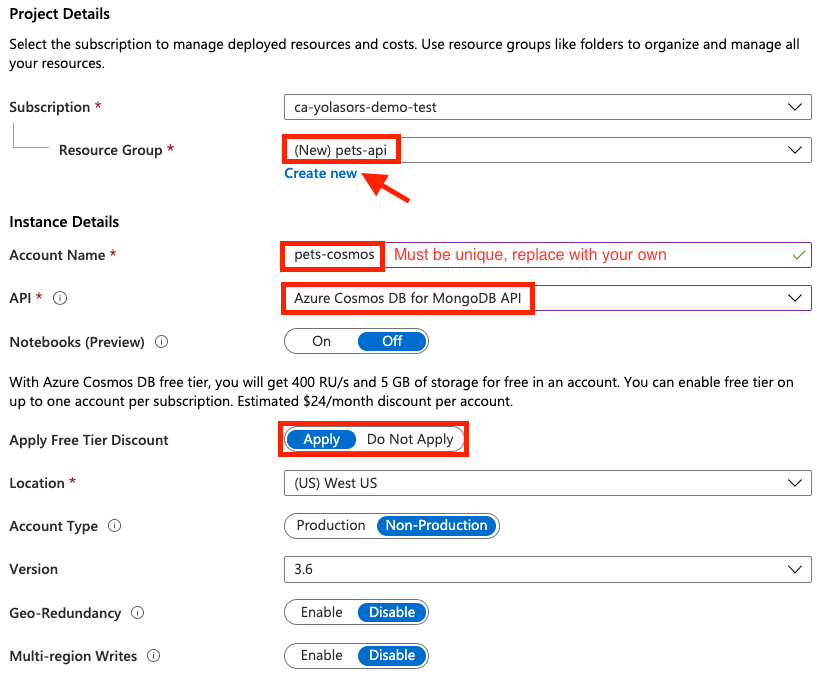
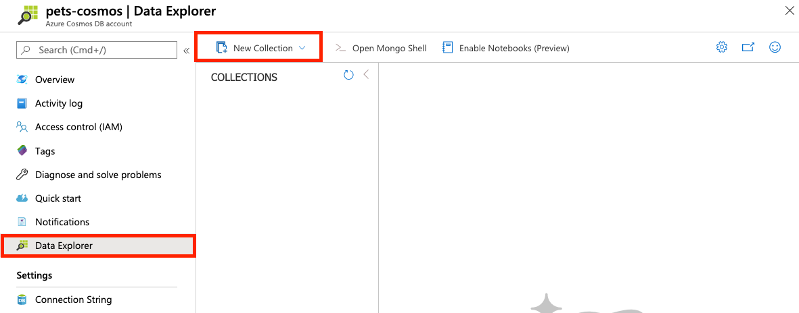
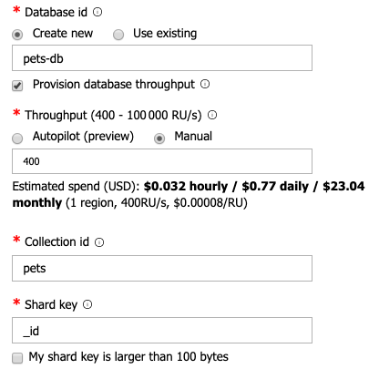
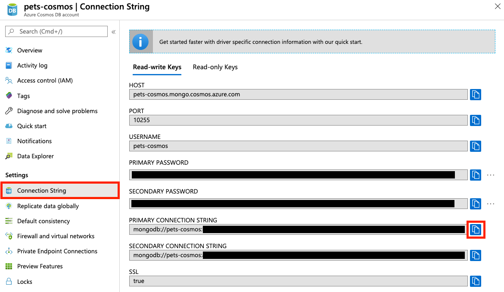
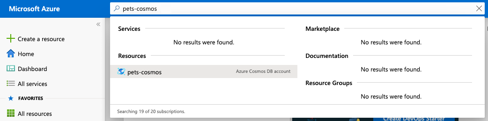
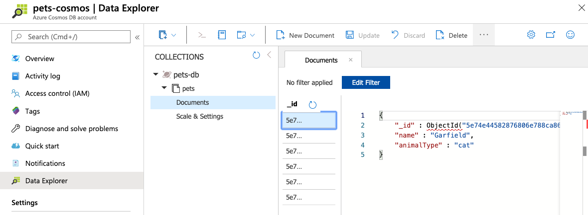

If you are building an API for your application, one of the first questions you will probably ask yourself is ***where to store my data?***

Most of the time the answer will be *in a database*, but which one? Especially if you are looking for good performance at a cheap price (or for free), your options are quite reduced. Good news, [a free tier has been introduced for Azure Cosmos DB](https://devblogs.microsoft.com/cosmosdb/build-apps-for-free-with-azure-cosmos-db-free-tier/) that is suitable for production workloads, with up to 5 GB storage included.

In this article, we will go through **all** the steps to configure and use an [Azure Cosmos DB](https://azure.microsoft.com/services/cosmos-db/?WT.mc_id=devto-blog-yolasors) database in a new [NestJS](https://nestjs.com) application.

## TL;DR key takeaways

- NestJS provides an excellent TypeORM integration that simplifies database usage a lot.
- Azure Cosmos DB can be used with many different drivers including MongoDB, allowing easy integration with existing libraries.
- While TypeORM primary focus is SQL databases, it also works very well with NoSQL using MongoDB.

Here is the final project [source code on GitHub](https://github.com/sinedied/pets-api).

## What will you learn here?

In this article, we will:
- Bootstrap a Node.js API from scratch using NestJS
- Create a free Azure Cosmos DB database with MongoDB support
- Configure TypeORM for MongoDB connection
- Create an entity to map your model with the database
- Add CRUD endpoints to your NestJS app

### Reference links for everything we use

- [NestJS](https://nestjs.com) with [@nestjs/typeorm](https://github.com/nestjs/typeorm) for the backend
- [Azure Cosmos DB](https://azure.microsoft.com/services/functions/?WT.mc_id=devto-blog-yolasors) for the database
- [TypeORM](https://typeorm.io) with [MongoDB driver](https://github.com/mongodb/node-mongodb-native) to access the database

## Requirements

- A working [Node.js](https://nodejs.org) environment
- An Azure account to create the Cosmos DB database. If you don't have an account, you can [create one for free using this link](https://azure.microsoft.com/free/?WT.mc_id=devto-blog-yolasors).

As an alternative, if you don't want to create an Azure subscription you can also use the [Try Cosmos DB](https://azure.microsoft.com/try/cosmosdb/?WT.mc_id=devto-blog-yolasors) website to get access to a Cosmos DB trial instance.

## Getting started

Your API will be built using [NestJS](https://nestjs.com).

If you're not familiar with NestJS, it's a [TypeScript](https://www.typescriptlang.org) Node.js framework that looks a lot like Angular and helps you build enterprise-grade efficient and scalable Node.js applications.

### Install NestJS CLI and bootstrap new server app

Use the following commands to install the NestJS CLI and create a new app:

```sh
$ npm install -g @nestjs/cli
$ nest new pets-api
$ cd pets-api
```

We will create a simple pet management API as an example, so let's create a controller for that using this command:

```sh
$ nest generate controller pets
```

You are now ready to integrate the database.

## Configure Cosmos DB

[Cosmos DB](https://azure.microsoft.com/services/cosmos-db/?WT.mc_id=devto-blog-yolasors) is a managed distributed NoSQL database that will allow you to save and retrieve data. It supports multiple data models and many well-known database APIs, including [MongoDB](https://www.mongodb.com/) that we will use for our application.


First, we have to create a Cosmos DB account, which can hold one or more databases. Make sure you have an [Azure account](https://azure.microsoft.com/free/?WT.mc_id=devto-blog-yolasors) before going through these steps:

1. Click on this link: [Create Azure Cosmos DB Account](https://ms.portal.azure.com/?WT.mc_id=devto-blog-yolasors#create/Microsoft.DocumentDB). Log in if needed, then fill-up the form like this:

    

    When you are finished, click on **Review + create**, then finally **Create**.

2. Provisioning the database will take a few minutes, so you can continue to the next section and come back once it's finished. When it's ready, click on **Go to resource**.

3. Click on the **Data Explorer** tab, then on the **New Collection** button:

    

4. Fill in the fields like this:

    

    > There are two things worth mentioning here:
    > - We choose to share a provisioned throughput of [Request Units](https://docs.microsoft.com/azure/cosmos-db/request-units?WT.mc_id=devto-blog-yolasors) among all our collections within our database, using the checkbox `Provision database throughput`. This greatly helps to reduce costs when using a paid account.
    > - We need to define a shard key (also called [partition key](https://docs.microsoft.com/azure/cosmos-db/partitioning-overview?WT.mc_id=devto-blog-yolasors#choose-partitionkey)) for the collection, to ensure proper [partitioning](https://docs.microsoft.com/azure/cosmos-db/partitioning-overview?WT.mc_id=devto-blog-yolasors). We use the default auto-generated `_id` property by MongoDB for that.

5. Finally, go to the `Connection strings` tab and click on the button next to your primary connection string to copy it:

    

Now create a `.env` file in your project root with these values:
```
MONGODB_CONNECTION_STRING=<your primary connection string>
MONGODB_DATABASE=pets-db
```

> Note: you should NEVER commit the `.env` file to your repository! This file is only for local testing, so add it to your `.gitignore` file.

These values will be exposed to your app as **environment variables** during development to access to your database. To do that we use the `@nestjs/config` package that provides [dotenv](https://github.com/motdotla/dotenv) integration:

```sh
npm i @nestjs/config
```

Open the file `src/app.module.ts` and add this to the module imports:
```ts
...
import { ConfigModule } from '@nestjs/config';

@Module({
  imports: [
    ConfigModule.forRoot(),
    ...
  ]
```

That's all we need for now, but keep in mind that `@nestjs/config` provides [a lot more options](https://docs.nestjs.com/techniques/configuration) for advanced needs.

## Integrate with NestJS

You are now ready to use the database in your application. NestJS provides a great integration with [TypeORM](https://typeorm.io) which is the most mature Object Relational Mapper (ORM) available for TypeScript, so we will use that.

First, you have to install a few more packages with this command:

```sh
npm install @nestjs/typeorm typeorm mongodb
```

Open the file `src/app.module.ts` and add `TypeOrmModule` to the module imports:
```ts
import { TypeOrmModule } from '@nestjs/typeorm';

@Module({
  imports: [
    TypeOrmModule.forRoot({
      type: 'mongodb',
      url: process.env.MONGODB_CONNECTION_STRING,
      database: process.env.MONGODB_DATABASE,
      entities: [
        __dirname + '/**/*.entity{.ts,.js}',
      ],
      ssl: true,
      useUnifiedTopology: true,
      useNewUrlParser: true
    }),
    ...
  ]
```

> Tip: Using `process.env.<VARIABLE_NAME>` in place of hardcoded values allows to keep sensitive information out of your codebase and read them from environment variables instead. This also allows you to deploy the exact same code on different environments (like staging and production for example), but with different configurations, as recommended in the [12-factor app](https://12factor.net/config) best practices.

TypeORM will discover and map your entities following the `*.entity.ts` (`.js` once compiled) naming scheme, as specified in the module options.

But hey, we don't have an entity yet? That's right, let's create it!

## Create an entity

A database entity is used to model the properties of whatever object you would like to store. In our case, we would like to store pet data, so let's create define a `Pet` entity.

Create a new file `src/pets/pet.entity.ts` with this code:
```ts
import { Entity, ObjectID, ObjectIdColumn, Column } from 'typeorm';

@Entity('pets')
export class Pet {
  @ObjectIdColumn() id: ObjectID;
  @Column() name: string;
  @Column() animalType: string;
  @Column() pictureUrl?: string;
  @Column() birthDate?: Date;

  constructor(pet?: Partial<Pet>) {
    Object.assign(this, pet);
  }
}
```

Now let's break down the annotations we have used:

- `@Entity` marks the class as a TypeORM entity to be stored into the `pets` collection.
- `@ObjectIdColumn` marks the unique identifier of an entity that will be mapped to the mandatory MongoDB `_id` property. It will be automatically generated if you don't provide one.
- `@Column` marks the properties you want to map to a table column. The type of property will also define the type of data that will be stored.

> Note: for more complex domain models you can define subdocuments using simple type references, see [this example](https://typeorm.io/#/mongodb/defining-subdocuments-embed-documents).

## Inject the repository

TypeORM supports the [repository design pattern](https://docs.microsoft.com/dotnet/architecture/microservices/microservice-ddd-cqrs-patterns/infrastructure-persistence-layer-design?WT.mc_id=devto-blog-yolasors#the-repository-pattern), and `@nestjs/typeorm` package provides you an easy way to declare injectable repositories for each of your entities.

Open the file `src/app.module.ts` again and add this to the module imports:
```ts
import { Pet } from './pets/pet.entity';

@Module({
  imports: [
    TypeOrmModule.forFeature([Pet]),
    ...
  ]
```

Now you can inject your `Pet` repository using the annotation `@InjectRepository`. Open the file `src/pets/pets.controller.ts` and add this constructor:

```ts
@Controller('pets')
export class PetsController {
  constructor(
    @InjectRepository(Pet)
    private readonly petsRepository: MongoRepository<Pet>,
  ) {}
  ...
}
```

Don't forget to add these missing imports at the top of the file:

```ts
import { InjectRepository } from '@nestjs/typeorm';
import { MongoRepository } from 'typeorm';
import { ObjectID } from 'mongodb';
import { Pet } from './pet.entity';
```

You can now use `this.petsRepository` within your controller to perform CRUD operations (method signatures were simplified for readability):

- `save(entity: PartialEntity<Entity> | PartialEntity<Entity>[], options?: SaveOptions): Promise<Entity | Entity[]>`: inserts one or more entities in the database if they do not exists, updates otherwise.
- `findOne(criteria?: ObjectID | FindOneOptions<Entity>): Promise<Entity | undefined>`: finds the first entity matching an ID or query options.
- `find(criteria?: FindManyOptions<Entity>): Promise<Entity[]>`: finds all entities that match the specified criteria (return all entities if none is provided).
- `update(criteria: ObjectID | ObjectID[] | FindConditions<Entity>, partialEntity: PartialEntity<Entity> | PartialEntity<Entity>[]): Promise<UpdateResult>`: updates entities matching the specified criteria. It allows partial updates, but does not check if entities exists.
- `delete(criteria: ObjectID | ObjectID[] | FindConditions<Entity>): Promise<DeleteResult>`: removes one or more entities matching the specified criteria from the database. Does not check if entities exists.

In all these methods, you can either use the entity ID or a regular [MongoDB query](https://docs.mongodb.com/manual/tutorial/query-documents/) to match specific entities. For example, you can use:

```ts
// Find all cats
await this.petsRepository.find({ animalType: 'cat' });

// Find the pet with the specified ID
await this.petsRepository.findOne(id);
```

## Add new endpoints

Now you have everything needed to create your CRUD (Create, Read, Update and Delete) endpoints:
```
GET /pets         // Get all pets
GET /pets/:id     // Get the pet with the specified ID
POST /pets        // Create a new pet
PUT /pets/:id     // Update the pet with the specified ID
DELETE /pets/:id  // Delete the pet with the specified ID
```

### Read

Let's start with the first one, to get all the pets. Add this method to your controller:
```ts
@Get()
async getPets(): Promise<Pet[]> {
  return await this.petsRepository.find();
}
```

Easy right 😎? By not specifying any criteria for the `find()` method, all entities in the collection will be returned.

Now continue with the next one, to retrieve a single pet using its ID:
```ts
@Get(':id')
async getPet(@Param('id') id): Promise<Pet> {
  const pet = ObjectID.isValid(id) && await this.petsRepository.findOne(id);
  if (!pet) {
    // Entity not found
    throw new NotFoundException();
  }
  return pet;
}
```

We use the `@Get()` annotation like previously, but this time we add a [route parameter](https://docs.nestjs.com/controllers#route-parameters) using `:id`. This parameter can then be retrieved with the function arguments using the `@Param('id')` annotation.

We check that the provided string is a valid MongoDB `ObjectID` and then we call the `petsRepository.findOne()` method to find the matching entity. In case it's not found or if the provided ID is invalid, we return a status `404` error using NestJS predefined exception class `NotFoundException`.

### Create

Now for the pet creation:
```ts
@Post()
async createPet(@Body() pet: Partial<Pet>): Promise<Pet> {
  if (!pet || !pet.name || !pet.animalType) {
    throw new BadRequestException(`A pet must have at least name and animalType defined`);
  }
  return await this.petsRepository.save(new Pet(pet));
}
```

Here we use the `@Body()` annotation as a function parameter to retrieve the request data for our pet. We also add basic validation and return a status `400` error with a message, using NestJS `BadRequestException`.

> Tip: for more advanced validation techniques using DTOs (Data Transfer Objects) and annotations you can take a look at [this documentation](https://docs.nestjs.com/techniques/validation).

### Update

For the update endpoint, it's sort of a mix between *read* and *create*:
```ts
@Put(':id')
@HttpCode(204)
async updatePet(@Param('id') id, @Body() pet: Partial<Pet>): Promise<void> {
  // Check if entity exists
  const exists = ObjectID.isValid(id) && await this.petsRepository.findOne(id);
  if (!exists) {
    throw new NotFoundException();
  }
  await this.petsRepository.update(id, pet);
}
```

We added the annotation `@HttpCode(204)` to change the HTTP status to `204` (No Content) as we don't return anything if the update succeeds. We also need to check if an entity exists before updating it.

### Delete

Finally, we add the delete method which looks a lot like the previous one:
```ts
@Delete(':id')
@HttpCode(204)
async deletePet(@Param('id') id): Promise<void> {
  // Check if entity exists
  const exists = ObjectID.isValid(id) && await this.petsRepository.findOne(id);
  if (!exists) {
    throw new NotFoundException();
  }
  await this.petsRepository.delete(id);
}
```

CRUD endpoints, done ✔️.

> If you want to know more about available annotations and helpers you can use in your controllers, you can look at the [NestJS documentation](https://docs.nestjs.com/controllers#full-resource-sample) and the [TypeORM documentation](https://typeorm.io/#/repository-api/repository-api).

## Test your endpoints

Now it's time to test if your REST API works, start your server with the command:

```sh
npm run start
```

When the server is started, you can test if your new endpoints behave correctly using `curl`:

```sh
curl http://localhost:3000/pets
# should return an empty list: []

curl http://localhost:3000/pets/0
# should return 404 with an error

curl http://localhost:3000/pets \
  -X POST \
  -H "content-type: application/json" \
  -d '{ "name": "Garfield", "animalType": "cat" }'
# should return the newly created pet

curl http://localhost:3000/pets
# should return a list including the previously added pet

curl http://localhost:3000/pets/<id_from_post_command> \
  -X PUT \
  -H "content-type: application/json" \
  -d '{ "pictureUrl": "https://placekitten.com/400/600" }'
# should update the pet

curl http://localhost:3000/pets/<id_from_post_command>
# should return the updated pet

curl http://localhost:3000/pets/<id_from_post_command> \
  -X DELETE
# should delete the pet
```

## Explore your data

Once you have played a bit with your API and created some pets, why not take a look at your data?

You can either use the standalone [Storage Explorer application](https://azure.microsoft.com/features/storage-explorer/?WT.mc_id=devto-blog-yolasors) for that or go to the Azure portal and access the online version.

We only want to give a quick look, so let's use the online version:

1. Go back to [portal.azure.com](https://portal.azure.com?WT.mc_id=devto-blog-yolasors)

2. Use the search bar at the top and enter the name of the Cosmos DB account you created, then click on it in the search results:

    

3. Click on **Storage Explorer** in the resource menu, then unfold the `pets-db` database and `pets` collection to open the **Documents** where your data lives in:

    

From there, you can query your pets, edit or delete them and even create new ones.
This tool can be helpful to quickly check your data visually and debug things when something's wrong.

## Going further

This was a brief introduction, but you have already seen how quickly you can create a basic CRUD API with NestJS and Azure Cosmos DB.

If you want to dig further into NestJS or Azure, here are some resources I recommend:

- [Learn how to build and deploy a complete serverless backend using NestJS and Azure (free workshop)](https://aka.ms/nitro-ws)
- [Integrate MongoDB database with NestJS using Mongoose](https://docs.nestjs.com/techniques/mongodb)
- [Azure Storage module for NestJS](https://github.com/nestjs/azure-storage)

---

Follow me on [Twitter](http://twitter.com/sinedied), I would be happy to discuss and take your suggestions!
