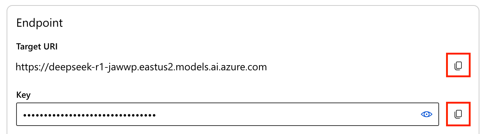
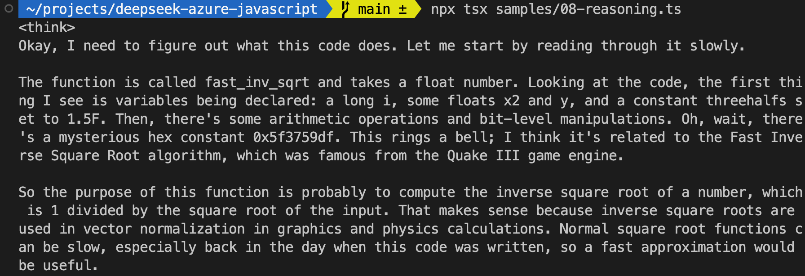

# Using DeepSeek-R1 on Azure with JavaScript

The pace at which innovative AI models are being developed is outstanding! DeepSeek-R1 is one such model that focuses on complex reasoning tasks, providing a powerful tool for developers to build intelligent applications.

Just yesterday, we announced its availability on [GitHub Models](https://github.blog/changelog/2025-01-29-deepseek-r1-is-now-available-in-github-models-public-preview/)
as well as on [Azure AI Foundry](https://azure.microsoft.com/en-us/blog/deepseek-r1-is-now-available-on-azure-ai-foundry-and-github/). In this article, we’ll take a look at how you can deploy and use the DeepSeek-R1 models in your JavaScript applications.

## TL;DR key takeaways
- DeepSeek-R1 models focus on complex reasoning tasks, and is not designed for general conversation
- You can quickly switch your configuration to use Azure AI, GitHub Models, or even local models with Ollama.
- You can use [OpenAI Node SDK](https://www.npmjs.com/package/openai) or [LangChain.js](https://js.langchain.com) to interact with DeepSeek models.

## What you'll learn here
- Deploying DeepSeek-R1 model on Azure.
- Switching between Azure, GitHub Models, or local (Ollama) usage.
- Code patterns to start using DeepSeek-R1 with various libraries in TypeScript.

## Reference links
- [DeepSeek on Azure - JavaScript demos repository](https://github.com/Azure-Samples/deepseek-azure-javascript)
- [Azure AI Foundry](https://ai.azure.com/)
- [OpenAI Node SDK](https://www.npmjs.com/package/openai)
- [LangChain.js](https://js.langchain.com)
- [Ollama](https://ollama.com/)

## Requirements
- **GitHub account**. If you don't have one, you can [create a free GitHub account](https://github.com/signup). You can optionally use [GitHub Copilot Free](https://github.com/features/copilot) to help you write code and ship your application even faster.
- **Azure account**. If you're new to Azure, [get an Azure account for free](https://azure.microsoft.com/free) to get free Azure credits to get started. If you're a student, you can also get free credits with [Azure for Students](https://aka.ms/azureforstudents).

## Getting started

We'll use [GitHub Codespaces](#use-github-codespaces) to get started quickly, as it provides a preconfigured Node.js environment for you. Alternatively, you can set up a local environment using the instructions found [in the GitHub repository](https://github.com/Azure-Samples/deepseek-azure-javascript#use-your-local-environment).

Click on the button below to open our sample repository in a web-based VS Code, directly in your browser:

[](https://codespaces.new/Azure-Samples/deepseek-azure-javascript?hide_repo_select=true&ref&quickstart=true)

Once the project is open, wait a bit to ensure everything has loaded correctly. Open a terminal and run the following command to install the dependencies:

```bash
npm install
```

## Running the samples

The repository contains several TypeScript files under the `samples` directory that demonstrate how to interact with DeepSeek-R1 models. You can run a sample using the following command:

```
npx tsx samples/<sample>.ts
```

For example, let's start with the first one:

```bash
npx tsx samples/01-chat.ts
```

Wait a bit, and you should see the response from the model in your terminal.
You'll notice that it may take longer than usual to respond, and see a weird response that starts with a `<think>` tag. This is because DeepSeek-R1 is designed to be used for task that need complex reasoning, like solving problems or answering math questions, and not for you usual chat interactions.

## Model configuration

By default, the repository is configured to use GitHub Models, so you can run any example using Codespaces without any additional setup. While it's great for quick experimentation, GitHub models limit the number of requests you can make in a day and the amount of data you can send in a single request. If you want to use the model more extensively, you can switch to Azure AI or even use a local model with Ollama. You can take a look at the `samples/config.ts` to see how the different configurations are set up.

We'll not cover using Ollama models in this article, but you can find more information in the [repository documentation](https://github.com/Azure-Samples/deepseek-azure-javascript#using-ollama).

## Deploying DeepSeek-R1 on Azure

To experiment with the full capabilities of DeepSeek-R1, you can deploy it on Azure AI Foundry. Azure AI Foundry is a platform that allows you to deploy, manage and develop with AI models quickly. To use Azure AI Foundry, you need to have an [Azure account](https://azure.com/free).

Let's start by deploying the model on Azure AI Foundry. First, follow this [tutorial](https://learn.microsoft.com/azure/ai-studio/how-to/deploy-models-serverless?tabs=azure-ai-studio) to deploy a serverless endpoint with the model. When it's time to choose the model, make sure to select the `DeepSeek-R1` model in the catalog.

Once your endpoint is deployed, you should be able to see your endpoint details and retrieve the URL and API key:



Then create a `.env` file in the root of the project and add the following content:

```env
AZURE_AI_BASE_URL="https://<your-deployment-name>.<region>.models.ai.azure.com/v1"
AZURE_AI_API_KEY="<your-api-key>"
```

> **Tip**: if you're copying the endpoint from the Azure AI Foundry portal, make sure to add the `/v1` at the end of the URL.

Open the `samples/config.ts` file and update the default export to use Azure:

```ts
export default AZURE_AI_CONFIG;
```

Now all samples will use the Azure configuration.

## Explore reasoning with DeepSeek-R1

Now that you have the model deployed, you can start experimenting with it. Open the `samples/08-reasoning.ts` file to see how the model handles more complex tasks, like helping us understand a well-known weird piece of code.

```ts
const prompt = `
float fast_inv_sqrt(float number) {
  long i;
  float x2, y;
  const float threehalfs = 1.5F;

  x2 = number * 0.5F;
  y  = number;
  i  = *(long*)&y;
  i  = 0x5f3759df - ( i >> 1 );
  y  = *(float*)&i;
  y  = y * ( threehalfs - ( x2 * y * y ) );

  return y;
}

What is this code doing? Explain me the magic behind it.
`;
```

Now run this sample with the command:

```bash
npx tsx samples/08-reasoning.ts
```

You should see the model's response streaming piece by piece in the terminal, while describing its thought process before providing the actual answer to our question.



Brace yourself, as it might take a while to get the full response! At the end of the process, you should see the model's detailed explanation of the code, along with some context around it.

## Leveraging frameworks

Most examples in this repository are built with the OpenAI Node SDK, but you can also use LangChain.js to interact with the model. This might be especially interested if you need to integrate other sources of data or want to build a more complex application.

Open the file `samples/07-langchain.ts` to have a look at the setup, and see how you can reuse the same configuration we used with the OpenAI SDK.

## Going further

Now it's your turn to experiment and discover the full potential of DeepSeek-R1! You can try more advanced prompts, integrate it into your larger application, or even build agents to make the most out of the model. 

To continue your learning journey, you can check out the following resources:

- [Generative AI with JavaScript](https://github.com/microsoft/generative-ai-with-javascript) (GitHub): code samples and resources to learn Generative AI with JavaScript.
- [Build a serverless AI chat with RAG using LangChain.js](https://techcommunity.microsoft.com/t5/apps-on-azure-blog/build-a-serverless-ai-chat-with-rag-using-langchain-js/ba-p/4111041) (GitHub): a next step code example to build an AI chatbot using Retrieval-Augmented Generation and LangChain.js.
