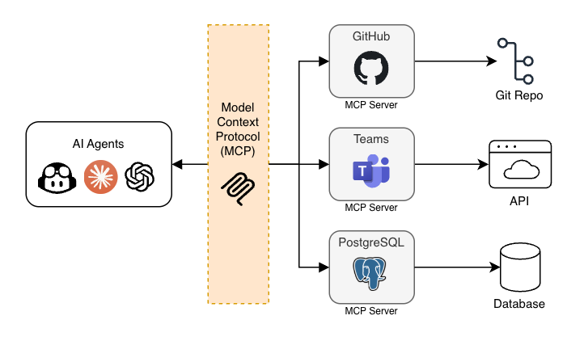
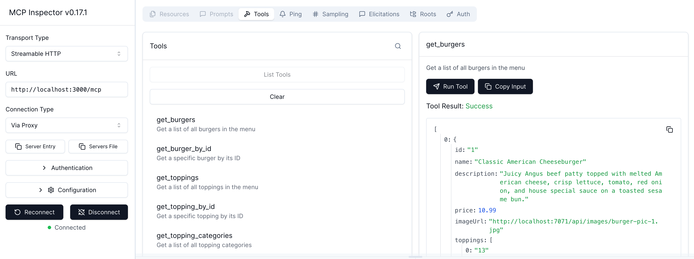
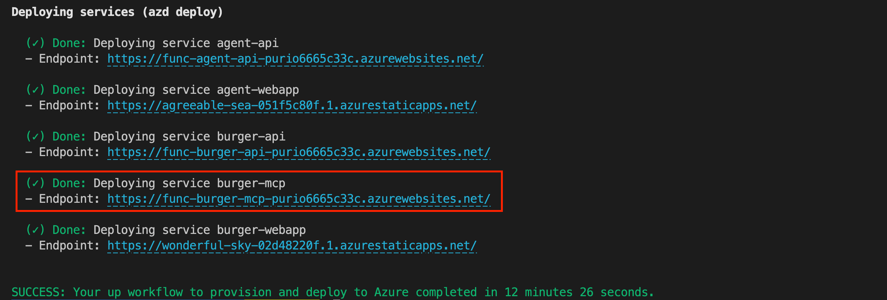

Building AI agents with the Model Context Protocol (MCP) is powerful, but when it comes to hosting your MCP server in production, you need a solution that's reliable, scalable, and cost-effective. What if you could deploy your regular Node.js MCP server to a serverless platform that handles scaling automatically while you only pay for what you use?

Let's explore how Azure Functions now supports hosting MCP servers built with the official Anthropic MCP SDK, giving you serverless scaling with almost no changes in your code.

Grab your favorite hot beverage, and let's dive in!

## TL;DR key takeaways

- Azure Functions now supports hosting Node.js MCP servers using the official Anthropic SDK
- Only 3 simple configurations needed: `host.json`, port configuration, and `function.json`
- Currently supports HTTP Streaming protocol with stateless servers
- Serverless hosting means automatic scaling and pay-per-use pricing
- Deploy with one command using Infrastructure as Code

## What will you learn here?

- Understand how MCP servers work on Azure Functions
- Configure a Node.js MCP server for Azure Functions hosting
- Test your MCP server locally and with real AI agents
- Deploy your MCP server with Infrastructure as Code and AZD

## Reference links for everything we use

- [Model Context Protocol](https://modelcontextprotocol.io/) - Official MCP documentation
- [Azure Functions](https://learn.microsoft.com/azure/azure-functions/functions-overview) - Serverless compute platform
- [Anthropic MCP SDK](https://github.com/modelcontextprotocol/typescript-sdk) - Official TypeScript SDK
- [Azure Developer CLI](https://learn.microsoft.com/azure/developer/azure-developer-cli/overview) - One-command deployment tool
- [Full sample project](https://github.com/Azure-Samples/mcp-agent-langchainjs) - Complete burger ordering system with MCP
- [Simple example](https://github.com/Azure-Samples/mcp-sdk-functions-hosting-node) - Minimal MCP server starter
- [GitHub Copilot prompt helper](https://github.com/anthonychu/create-functions-mcp-server) - Automated setup by Anthony Chu

## Requirements

- Node.js 22 or higher
- [Azure account](https://azure.microsoft.com/free) (free signup, or if you're a student, [get free credits here](https://azure.microsoft.com/free/students))
- [Azure Developer CLI](https://aka.ms/azure-dev/install) (for deployment)
- [GitHub account](https://github.com/signup) (optional, for using Codespaces)

## What is MCP and why does it matter?

Model Context Protocol is an open standard that enables AI models to securely interact with external tools and data sources. Instead of hardcoding tool integrations, you build an MCP server that exposes capabilities (like browsing a menu, placing orders, or querying a database) as tools that any MCP-compatible AI agent can discover and use. MCP is model-agnostic, meaning it can work with any LLM that supports the protocol, including models from Anthropic, OpenAI, and others. It's also worth noting that MCP supports more than just tool calls, though that's its most common use case.



The challenge? **Running MCP servers in production requires infrastructure**. You need to handle scaling, monitoring, and costs. That's where Azure Functions comes in.

> **🚨 Free course alert!** If you're new to MCP, check out the [MCP for Beginners](https://github.com/microsoft/mcp-for-beginners) course to get up to speed quickly.

## Why Azure Functions for MCP servers?

Azure Functions is a serverless compute platform that's perfect for MCP servers:

- **Zero infrastructure management**: No servers to maintain
- **Automatic scaling**: Handles traffic spikes seamlessly
- **Cost-effective**: Pay only for actual execution time (with generous free tier)
- **Built-in monitoring**: Application Insights integration out of the box
- **Global distribution**: Deploy to regions worldwide

The new Azure Functions support means you can take your existing Node.js MCP server and deploy it to a production-ready serverless environment with minimal changes. This comes up as an additional option for native Node.js MCP hosting, but you can still use the [Azure Functions MCP bindings](https://learn.microsoft.com/azure/azure-functions/functions-bindings-mcp?pivots=programming-language-typescript) that were available before.

## 3 simple steps to enable Functions hosting

Let's break down what you need to add to your existing Node.js MCP server to run it on Azure Functions. I'll use a [real-world example](https://github.com/Azure-Samples/mcp-agent-langchainjs/tree/main/packages/burger-mcp) from our burger ordering system.

If you already have a working Node.js MCP server, you can just follow these three steps to make it compatible with Azure Functions hosting.

### Step 1: Add the `host.json` configuration

Create a `host.json` file at the root of your Node.js project:

```json
{
  "version": "2.0",
  "extensions": {
    "http": {
      "routePrefix": ""
    }
  },
  "customHandler": {
    "description": {
      "defaultExecutablePath": "node",
      "workingDirectory": "",
      "arguments": ["lib/server.js"]
    },
    "enableForwardingHttpRequest": true,
    "enableHttpProxyingRequest": true
  }
}
```

> **Note:** Adjust the `arguments` array to point to your compiled server file (e.g., `lib/server.js` or `dist/server.js`), depending on your build setup.

This configures the Azure Functions runtime to run your Node.js MCP server as a *custom handler*, which allows you to use any HTTP server framework (like Express, Fastify, etc.) without modification (**tip: it can do more than MCP servers!** 😉).

### Step 2: Configure the port correctly

In your server code, use the special environment variable that Azure Functions provides:

```typescript
const PORT = process.env.FUNCTIONS_CUSTOMHANDLER_PORT || process.env.PORT || 3000;

app.listen(PORT, () => {
  console.log(`MCP server listening on port ${PORT}`);
});
```

While most applications use the `PORT` environment variable, Azure Functions requires `FUNCTIONS_CUSTOMHANDLER_PORT` for custom handlers. This can usually be easily accommodated with a fallback, so you're not breaking compatibility with local development or other hosting environments.

**Note:** This is the only code change you need to make to your existing MCP server!

### Step 3: Add the `handler/function.json` file

Create a `handler` directory with a `function.json` file and add the following content:

```json
{
  "bindings": [
    {
      "authLevel": "anonymous",
      "type": "httpTrigger",
      "direction": "in",
      "name": "req",
      "methods": ["get", "post", "put", "delete", "patch", "head", "options"],
      "route": "{*route}"
    },
    {
      "type": "http",
      "direction": "out",
      "name": "res"
    }
  ]
}
```

This file tells Azure Functions to route **all** HTTP requests to your MCP server. No configuration needed here, and this boilerplate file might even not be necessary in future versions.

Aaand you're done with the configuration. That's it! 😎

### Automated setup with GitHub Copilot

While these changes are pretty straightforward, you might want to automate this (boring) process. That's why we have AI tools for, right?

My friend Anthony Chu created an awesome GitHub Copilot prompt that automates this entire setup process. Just ask Copilot to use the prompt from [create-functions-mcp-server](https://github.com/anthonychu/create-functions-mcp-server) and it will:

- Add the necessary configuration files
- Update the code where needed for the port configuration
- Set up the Infrastructure as Code

If you're not using Copilot, you can also copy the prompt instructions from the repo in your favorite AI coding assistant.

## Real-world example: Burger MCP Server

Let's look at how this works in practice with a [burger ordering MCP server](https://github.com/Azure-Samples/mcp-agent-langchainjs/tree/main/packages/burger-mcp). This server exposes 9 tools for AI agents to interact with a burger API:

- `get_burgers` - Browse the menu
- `get_burger_by_id` - Get burger details
- `place_order` - Place an order
- `get_orders` - View order history
- And more...

Here's the complete server implementation using Express and the MCP SDK:

```typescript
import express, { Request, Response } from 'express';
import { StreamableHTTPServerTransport } from '@modelcontextprotocol/sdk/server/streamableHttp.js';
import { getMcpServer } from './mcp.js';

const app = express();
app.use(express.json());

// Handle all MCP Streamable HTTP requests
app.all('/mcp', async (request: Request, response: Response) => {
  const transport = new StreamableHTTPServerTransport({
    sessionIdGenerator: undefined,
  });

  // Connect the transport to the MCP server
  const server = getMcpServer();
  await server.connect(transport);

  // Handle the request with the transport
  await transport.handleRequest(request, response, request.body);

  // Clean up when the response is closed
  response.on('close', async () => {
    await transport.close();
    await server.close();
  });

  // Note: error handling not shown for brevity
});

// The magic port configuration
const PORT = process.env.FUNCTIONS_CUSTOMHANDLER_PORT || process.env.PORT || 3000;
app.listen(PORT, () => {
  console.log(`Burger MCP server listening on port ${PORT}`);
});
```

The MCP tools are defined using the official SDK:

```typescript
import { McpServer } from '@modelcontextprotocol/sdk/server/mcp.js';
import { z } from 'zod';

export function getMcpServer() {
  const server = new McpServer({
    name: 'burger-mcp',
    version: '1.0.0',
  });

  server.registerTool(
    'get_burgers',
    { description: 'Get a list of all burgers in the menu' },
    async () => {
      const response = await fetch(`${burgerApiUrl}/burgers`);
      const burgers = await response.json();
      return {
        content: [{
          type: 'text',
          text: JSON.stringify(burgers, null, 2)
        }]
      };
    }
  );

  // ... more tools
  return server;
}
```

As you can see, the actual implementation of the tool is forwarding an HTTP request to the burger API and returning the result in the MCP response format. This is a common pattern for MCP tools in enterprise contexts, that act as wrappers around one or more existing APIs.

### Current limitations

Note that this Azure Functions MCP hosting currently has some limitations: **it only supports stateless servers using the HTTP Streaming protocol**. The legacy SSE protocol is not supported as it requires stateful connections, so you'll either have to migrate your client to use HTTP Streaming or use another hosting option, like using containers for example.

For most use cases, HTTP Streaming is the recommended approach anyway as it's more scalable and doesn't require persistent connections. Stateful MCP servers comes with additional complexity challenges and have limited scalability if you need to handle many concurrent connections.

## Testing the MCP server locally

First let's run the MCP server locally and play a bit with it.

If you don't want to bother with setting up a local environment, you can use the following link or open it in a new tab to launch a GitHub Codespace:

- [Create Codespace](https://codespaces.new/Azure-Samples/mcp-agent-langchainjs?hide_repo_select=true&ref=main&quickstart=true)

This will open a VS Code environment in your browser with the repo already cloned and all the tools installed and ready to go. Otherwise you can just [clone the repo](https://github.com/Azure-Samples/mcp-agent-langchainjs).

Once you have the code ready, open a terminal and run:

```sh
# Install dependencies
npm install

# Start the burger MCP server and API
npm start
```

This will start multiple services locally, including the Burger API and the MCP server, which will be available at `http://localhost:3000/mcp`. This may take a few seconds, wait until you see this message in the terminal:

```
🚀 All services ready 🚀
```

We're only interested in the MCP server for now, so let's focus on that.

### Using MCP Inspector

The easiest way to test the MCP server is with the MCP Inspector tool:

```sh
$ npx -y @modelcontextprotocol/inspector
```

Open the URL shown in the console in your browser, then:

1. Set transport type to **Streamable HTTP**
2. Enter your local server URL: `http://localhost:3000/mcp`
3. Click **Connect**

After you're connected, go to the **Tools** tab to list available tools. You can then try the `get_burgers` tool to see the burger menu.



### Using GitHub Copilot (with remote MCP)

Configure GitHub Copilot to use your deployed MCP server by adding this to your project's `.vscode/mcp.json`:

```json
{
  "servers": {
    "burger-mcp": {
      "type": "http",
      "url": "http://localhost:3000/mcp"
    }
  }
}
```

Click on "Start" button that will appear in the JSON file to activate the MCP server connection.

Now you can use Copilot in agent mode and ask things like:
- "What spicy burgers do you have?"
- "Place an order for two cheeseburgers"
- "Show my recent orders"

Copilot will automatically discover and use the MCP tools! 🎉

> **Tip:** If Copilot doesn't call the burger MCP tools, try checking if it's enabled by clicking on the tool icon in the chat input box and ensuring that "burger-mcp" is selected. You can also force tool usage by adding `#burger-mcp` in your prompt.

## (Bonus) Deploying to Azure with Infrastructure as Code

Deploying an application to Azure is usually not the fun part, especially when it involves multiple resources and configurations.
With the [Azure Developer CLI (AZD)](https://learn.microsoft.com/azure/developer/azure-developer-cli/overview), you can define your entire application infrastructure and deployment process as code, and deploy everything with a single command.

If you've used the automated setup with GitHub Copilot, you should already have the necessary files. Our burger example also comes with these files pre-configured. The MCP server is defined as a service in `azure.yaml`, and the files under the `infra` folder defines the Azure Functions app and related resources.

Here's the relevant part of `azure.yaml` that defines the burger MCP service:

```yaml
name: mcp-agent-langchainjs

services:
  burger-mcp:
    project: ./packages/burger-mcp
    language: ts
    host: function
```
While the infrastructure files can look intimidating at first, you don't need to understand all the details to get started. There are tons of templates and examples available to help you get going quickly, the important part is that everything is defined as code, so you can version control it and reuse it.

Now let's deploy:

```sh
# Login to Azure
azd auth login

# Provision resources and deploy
azd up
```

Pick your preferred Azure region when prompted (if you're not sure, choose **East US2**), and voilà! In a few minutes, you'll have a fully deployed MCP server running on Azure Functions.

Once the deployment is finished, the CLI will show you the URL of the deployed resources, including the MCP server endpoint.



## Example projects

The burger MCP server is actually part of a larger example project that demonstrates building an AI agent with LangChain.js, that uses the burger MCP server to place orders. If you're interested in the next steps of building an AI agent on top of MCP, this is a great resource as it includes:
- AI agent web API using LangChain.js
- Web app interface built with Lit web components
- MCP server on Functions (the one we just saw)
- Burger ordering API (used by the MCP server)
- Live order visualization
- Complete Infrastructure as Code, to deploy everything with one command

But if you're only interested in the MCP server part, then you might want to look at this simpler example that you can use as a starting point for your own MCP servers: [mcp-sdk-functions-hosting-node](https://github.com/Azure-Samples/mcp-sdk-functions-hosting-node) is a server template for a Node.js MCP server using TypeScript and MCP SDK.

## What about the cost?

Azure Functions Flex Consumption pricing is attractive for MCP servers:

- **Free tier**: 1 million requests and 400,000 GB-s execution time per month
- **After free tier**: Pay only for actual execution time
- **Automatic scaling**: From zero to hundreds of instances

The free tier is generous enough to allow running a typical MCP server with moderate usage, and all the experimentation you might need. It's easy to configure the scaling limits to control costs as needed, with an option to scale down to zero when idle. This flexibility is why Functions is my personal go-to choice for TypeScript projects on Azure.

## Wrap up

Hosting MCP servers on Azure Functions gives you the best of both worlds: the simplicity of serverless infrastructure and the power of the official Anthropic SDK. With just **three simple configuration steps**, you can take your existing Node.js MCP server and deploy it to a production-ready, auto-scaling platform.

The combination of MCP's standardized protocol and Azure's serverless platform means you can focus on building amazing AI experiences instead of managing infrastructure. Boom. 😎

Star the repos ⭐️ if you found this helpful! Try deploying your own MCP server and share your experience in the comments. If you run into any issues or have questions, you can reach for help on the [Azure AI community on Discord](https://aka.ms/foundry/discord).
