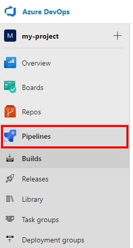
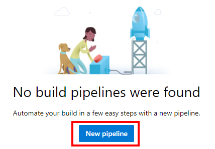
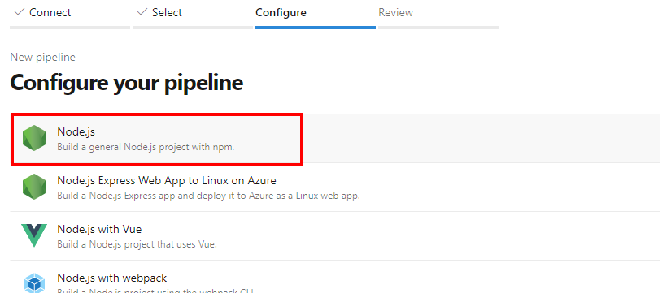
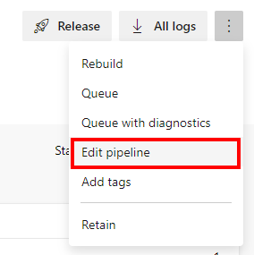
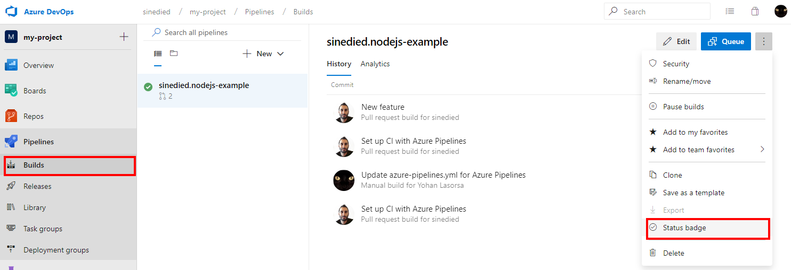

I spend a good part of my free time working on open-source software (OSS) on GitHub, and I do it (mostly) for fun and learning new things. But one thing that I can tell you is no fun, is losing time hunting bugs that I cannot reproduce... Or fighting with tools supposed to help you, like your continuous integration (CI) system.

Did you ever wonder on which CI/CD solution you should invest your time? You've come to the right place!

> *Mandatory disclosure: I now work for Microsoft, but I started thinking about CI migration way before switching job and I was NOT forced to do this in any way. My experience with OSS projects goes back far before my current job, and I tried to put my honest feedback as an OSS maintainer in this article.*

## TL;DR

- If you plan to maintain an open-source project in the long run, what you must do is **automate**
- The worst way of losing time is when your automated builds are not working as intended: flakiness, unreliable builds, and cross-platforms issues can (will) drive you crazy
- **Pragmatism** should be your main driver here, seek to get the job done for the least time invested

Based on this, I found that [Azure Pipelines](https://azure.microsoft.com/services/devops/pipelines/?WT.mc_id=devto-blog-yolasors) currently offers the best _time investment/benefits_ ratio in my opinion.

That may probably change once [GitHub Actions CI/CD](https://github.blog/2019-08-08-github-actions-now-supports-ci-cd/?WT.mc_id=devto-blog-yolasors) solution becomes available for everyone (planned for November, 13th). But until then I will stick with a tried & tested solution that allows me spending more time with my loved ones than fighting with build issues 🍸

## What will you learn here?

- How to setup [Azure Pipelines](https://azure.microsoft.com/services/devops/pipelines/?WT.mc_id=devto-blog-yolasors) for an open-source project hosted on GitHub (Node.js in this case, but it works for any stack)
- Why it can help you save some of your limited OSS working time

If you don't care for the back story, you [jump straight into action](#lets-do-it).

## The full story

It has been a few years now that I have been maintaining multiple open-source projects on GitHub, and through the years I have come to this conclusion:

- 🔥 Being a maintainer is hard _(no kidding!)_
- ⏲ It takes a lot of your free time _(that you might sometimes prefer spending with you family and friends)_
- 😭 Cutting corners to gain time in short-term almost always results in a lot of time lost in the long-term _(like with any software project)_

Jokes aside, the last point is easy to overlook and I fell into it too many times by not adding proper tests or CI, like:

> "I'm doing this mostly for myself, but I'll share it in case it can be useful to others"

### Oops, did not plan for that 😱

BIG MISTAKE. Once issues and PRs come, it's _too late_.
Reviewing, testing and deploying fixes and new features from your contributors becomes a black hole of time lost.


<figcaption>Black hole by Event Horizon Telescope Collaboration, <a href="https://creativecommons.org/licenses/by/4.0/">CC BY 4.0</a> // Altered with my awesome Paint skills</figcaption>

After a few projects though, it's probable that you don't make this mistake anymore and that you put in place a minimal CI pipeline as I did 😎

### Then it was fine. Somehow.

A few years ago, there was not so much choice if you wanted a free hosted CI solution for an open-source project. I was happy some solutions existed, given that it was, well... free.

That's how I ended up using most popular solutions such as [Travis CI](https://travis-ci.org), [AppVeyor](https://www.appveyor.com) and [CircleCI](https://circleci.com). Each one meets a specific need, but not any of these are perfect, unfortunately.

| Service   |                                                                                                                  | OSS Tier                                                                       |
| --------- | ---------------------------------------------------------------------------------------------------------------- | ------------------------------------------------------------------------------ |
| Travis CI | Simplest and most common way to get started with a CI on GitHub.                                                 | 5 concurrent jobs shared between _ALL_ your repositories<br>Linux + Mac builds |
| AppVeyor  | For a long time, it was the only CI platform providing a free tier for Windows builds.                           | 1 concurrent job<br>Windows + Linux builds.                                    |
| CircleCI  | The most flexible solution of these 3 as you can use your own container, but it's also the most complex to setup | 1 concurrent job<br>1000 builds minutes/month<br>Linux only builds             |

#### Red builds and issues

For most simple projects using any of these solutions might be just enough. But over time I ran into a bunch of problems, growing with the complexities of my projects.

##### The build matrix

First comes the problem of the environment: I develop on Mac OS, the CI runs on Linux... and issues appear on Windows. That's how I ended up using a combo of Travis CI + AppVeyor, like many projects.

Then there's the issue of being compatible with multiple platform versions. For example, a project supporting Node.js `>= 8` would be wise to test on all LTS version along with the latest stable version: that would mean at this time `8.x`, `10.x` and `12.x`.

Nearly all CI services support a build matrix definition for these use cases, so that's fine.

But when you start having _many projects_ and each one have _multiple builds_, total build time starts to become an issue: I already had to wait for days (!) to be able to merge some PRs because many came at the same time on different projects (and all were sharing the same worker limit). When your pipeline is already quite long (like 1h for a PR build), it can get problematic really fast.

##### Uncertainty is not welcome

Finally, there's the most dreaded issue that took countless hours of my life for nothing: flaky builds 😱.


Sometimes, for _no good reasons_, one or many of your builds fail. And you (or your contributors) lose time investigating the issue, discovering that the CI service is the problem, not the code.

If it's only once in the while and you're suspicious, you just restart the build and it passes. But sometimes not, making you spending precious time trying to fix the CI because:

- An unfortunate update (bug) was pushed (_shit happens_, but once it was there for WEEKS)
- Build container images were tweaked (and your CI goes 💥)
- _"We are currently experiencing technical difficulties"_
- No reason... 😞

And over time this makes you wary of your own CI, which is not a good thing.

I know I may have been asking too much and most OSS projects are just fine using these solutions.
Also to be completely fair, given that all these services are provided for free it's hard to complain.

### Meet Azure Pipelines

Some time ago I discovered that [JHipster](https://github.com/jhipster/generator-jhipster) had migrated all its CI to [Azure Pipelines](https://azure.microsoft.com/services/devops/pipelines/?WT.mc_id=devto-blog-yolasors). I knew this project for a long time and its CI complexity is nothing to laugh at, with a lot of combination paths and huge build times. So this got me interested and I tried to migrate some projects of my own to test it out.

Well, I was surprised to see that Azure Pipelines gives you quite a lot _for free_ compared to other solutions:

- It can target any OS (Windows/Mac/Linux)
- It's fast (10 parallels workers per organization for OSS tier )
- It seems more reliable (from my own experience and discussions with JHipster maintainers)
- It's quite easy to set up and get working (a bit more complex than Travis though, but with way more flexibility)

I started by migrating the tests of a [simple Node.js](https://github.com/sinedied/smoke) project of mine. The existing Travis/AppVeyor combo was replaced with a single Azure Pipeline to test on Windows/Mac/Linux, as done in [this PR](https://github.com/sinedied/smoke/pull/3/files). I had to disable git `autocrlf` option for [Prettier](https://prettier.io) check to be happy on Windows, but besides that the migration was trivial.

After this first success I moved on to migrate the much more complex and demanding CI of [generator-ngx-rocket](https://github.com/ngx-rocket/generator-ngx-rocket), and here is the result.

|              | Before                                                                                                             | After                                                            |
| ------------ | ------------------------------------------------------------------------------------------------------------------ | ---------------------------------------------------------------- |
| Service      | Travis + AppVeyor + Circle CI with custom Docker image                                                             | Azure Pipelines                                                  |
| Combinations | 40 builds on Travis (Linux \* 2 Node versions)<br>20 builds on AppVeyor (Windows)<br>1 build on CircleCI (Android) | 83 builds (Linux/Windows \* 2 Node versions + Mac/Android)       |
| Build time   | ~1h for a PR (~50min Travis, ~1h AppVeyor, ~5min CircleCI)                                                         | ~1h for a PR (~30min if limited to the previous Travis scenario) |

The migration was not trivial this time as I had to use [a template](https://github.com/ngx-rocket/generator-ngx-rocket/blob/master/.ci-templates/test.yml) to generate the combinations matrix, but the result is great:

- Only one config to manage (and no need to build an extra Docker image for Android)
- More combinations tested for the same time
- Some bonus like publication of Android built APKs directly as a build artifact

After this experience, I can say that I'm all for Azure Pipeline now and I will continue to migrate my other repositories 👍

> Hey wait, but what about the new [GitHub Actions for CI/CD](https://github.blog/2019-08-08-github-actions-now-supports-ci-cd/?WT.mc_id=devto-blog-yolasors)?!

I give you that it looks AWESOME, especially the OSS tier 😍
Once it becomes available for everyone on November 13th, it will probably become the best solution out there (and this article will be updated in that case 😉).

Two things to still consider Azure Pipelines though:

- If you are not invited as one of the beta testers, you won't be able to use GitHub Actions for now. But in the meantime, you probably want a working CI solution!
- GitHub Actions for CI/CD is based on parts of the Azure Pipelines stack, so migration should be a breeze if you are already using the latter

## Let's do it!

At this point, you may want to try it out for yourself. We will go through the steps to put in place an Azure Pipeline CI for your Node.js project (don't go away if you use another stack, it's not much different and I will give some pointers 😉).

You can see an example result [on this repository](https://github.com/sinedied/smoke).

**Requirements:**

- An [Azure DevOps account](https://azure.microsoft.com/services/devops/?WT.mc_id=devto-blog-yolasors) (you can use your GitHub account to log in)
- A GitHub repository with some tests you want to automate

### 1. Prepare your repository

First, you have to prepare your test scripts for the CI.

For a Node.js project, it's usually done by adding a `test` script in your `package.json` file:

```json
{
  "scripts": {
    "test": "jest"
  }
}
```

In this example, [Jest](https://jestjs.io) will be used to run the unit tests.

You can test your script by running `npm test`, to make sure everything works fine.

### 2. Create the Azure DevOps project

In your Azure DevOps account, create a new project and give it a name:


### 3. Setup the pipeline

After that, go to the **Pipelines** section on the left:



Then click `New pipeline` to start the setup process:



Choose `GitHub (YAML)`, then follow the process to link your account with Azure DevOps:


Select your repository, then authorize the app on GitHub.

After that, choose the first `Node.js` option (or any other relevant option for your tech stack):



> For other stacks and languages like C#, Java, Go, Python and so on you should take a look at the appropriate page in the [ecosystem section](https://docs.microsoft.com/azure/devops/pipelines/languages/dotnet-core?view=azure-devops&WT.mc_id=devto-blog-yolasors) of the docs. You will get specific hints at how you can set up your build with your favorite tech.

You can find a lot of examples YAML files in [this repository](https://github.com/microsoft/azure-pipelines-yaml/tree/master/templates).

### 4. Customize the YAML

You will then be presented with this YAML file in the editor:

```yaml
# Node.js
# Build a general Node.js project with npm.
# Add steps that analyze code, save build artifacts, deploy, and more:
# https://docs.microsoft.com/azure/devops/pipelines/languages/javascript

trigger:
  - master

pool:
  vmImage: 'ubuntu-latest'

steps:
  - task: NodeTool@0
    inputs:
      versionSpec: '10.x'
    displayName: 'Install Node.js'

  - script: |
      npm install
      npm run build
    displayName: 'npm install and build'
```

For now, you only need to change the last part to run the command `npm test` instead of `npm run build`:

```yaml
- script: |
    npm install
    npm test
  displayName: 'npm install and test'
```

Click `Save and run`, then choose whether to commit directly on `master` or create a new branch with a PR.

> I suggest you create a new branch with a PR at this stage so that you can experiment with the build configuration before merging it in your repository.

After that click `Save and run` again, then check that everything runs fine.

### 5. Adding a build matrix

Now you already have a working CI, but one of the benefits of using Azure Pipelines is that you can easily add cross-platform builds so let's do that.

Choose `Edit pipeline` in the menu to go back to the YAML editor:



First add this matrix at the top of your file:

```yaml
strategy:
  matrix:
    linux-node-10:
      imageName: 'ubuntu-latest'
      nodeVersion: '10.x'
    linux-node-latest:
      imageName: 'ubuntu-latest'
      nodeVersion: '>=12.x'
    mac-node-10:
      imageName: 'macos-latest'
      nodeVersion: '10.x'
    mac-node-latest:
      imageName: 'macos-latest'
      nodeVersion: '>=12.x'
    windows-node-10:
      imageName: 'windows-latest'
      nodeVersion: '10.x'
    windows-node-latest:
      imageName: 'windows-latest'
      nodeVersion: '>=12.x'
```

This will allow your tests to run on Windows, Linux and Mac OS using 2 different Node.js versions each time, for a total of 6 builds.

Then update the `pool` section to use the image name of the current build:

```yaml
pool:
  vmImage: $(imageName)
```

Finally update the `node` task to do the same for the Node.js version:

```yaml
- task: NodeTool@0
  inputs:
    versionSpec: $(nodeVersion)
  displayName: 'Install Node.js'
```

Click `Save`, then `Run` to test the updated pipeline and you're done.

> If you created a branch with a PR when saving the pipeline configuration the first time, you also need to go on GitHub and merge this PR first to activate the pipeline for new commits and PRs.

Don't forget to take a look at the full [documentation](https://docs.microsoft.com/azure/devops/pipelines/?view=azure-devops&WT.mc_id=devto-blog-yolasors), to see all the tasks and features available.

#### 6. Add a status badge (optional)


I highly recommend that you add a status badge on your GitHub repository so that people get a positive signal on your project:

- It's maintained and you care for its quality
- Contributors can push PRs with confidence

To do so, go back to your pipelines builds and click `Status badge` on the menu:



Then copy the markdown code using the button, and paste it at the top of your `readme.md` file at the root of your repository:


Once it's committed to the `master` branch it will become visible on the GitHub documentation of your project. The badge status will be updated automatically according to the last commit pushed on `master`.

> To complete this status badge with some others, take a look at https://shields.io.
> You can even build your own: 

#### 7. Enjoy your evenings

That's it!

Once a new commit or PR will be pushed to your repository, the CI will take care of it and show the result directly on GitHub:


Now you can relax and enjoy your free time again 🍻.

> For additional peace of mind, I suggest you enable [required status check](https://help.github.com/en/articles/enabling-required-status-checks) with your new CI so only PRs passing the selected checks are allowed to be merged.

Don't forget to share your feedback and experience in comments!

## Going further

Of course, there are many more things that you can do to simplify your life as a maintainer and I will share them in later posts. But I think CI is one of the first things you should put in place in any project.

There's also much more that you can do with Azure Pipelines _(did I mention CD somewhere?)_ but let's keep that for later 😉.

---

Follow me on [Twitter](http://twitter.com/sinedied), I would be happy to discuss and take your suggestions!
