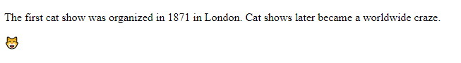
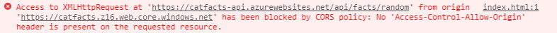

Ever wanted to take the plunge and see what it looks like to build a complete serverless app from scratch? Let's just do that!

In this article we will go through **all** the steps to bootstrap, build and deploy a complete application using the [Nitro](https://aka.ms/nitro) stack: [Angular](https://angular.io) for the frontend, [NestJS](https://nestjs.com) for the backend and [Azure Serverless platform](https://azure.microsoft.com/services/functions/?WT.mc_id=servsept_devto-blog-yolasors) for deployment.

The app we will build is a simple *"random cat fact"* that will fetch an interesting cat fact from our API and display it on a web page, like this:


> This article is part of [#ServerlessSeptember]( https://dev.to/azure/serverless-september-content-collection-2fhb). You'll find other helpful articles, detailed tutorials, and videos in this all-things-Serverless content collection. New articles are published every day — that's right, every day — from community members and cloud advocates in the month of September.
>
> Find out more about how Microsoft Azure enables your Serverless functions at [https://docs.microsoft.com/azure/azure-functions/](https://docs.microsoft.com/azure/azure-functions/?WT.mc_id=servsept_devto-blog-yolasors).

## TL;DR key takeaways

- If you like Angular, you should take a look at NestJS: it leverages the same concepts, features, and architecture but for Node.js backend development
- Preparing a NestJS app for serverless deployment with Azure Functions can be done with just `nest add @nestjs/azure-func-http` and requires no changes to the existing structure
- Nitro stack (= Angular + NestJS + Azure Serverless) allows you to build full-stack TypeScript apps in a consistent, robust and cost-efficient way

Here is the final project [source code on GitHub](https://github.com/sinedied/catfacts).

## What will you learn here?

In this article, we will:
- Build a serverless Node.js API from scratch using NestJS
- Build an Angular app and connect it to your backend for both local and remote development
- Use Azure Functions to deploy your API in a cost-efficient and scalable way
- Use Azure Storage static website hosting to deploy your Angular app with `ng deploy`

### Reference links for everything we use

- [Angular](https://angular.io) with [@azure/ng-deploy](https://github.com/Azure/ng-deploy-azure) for the frontend
- [NestJS](https://nestjs.com) with [@nestjs/azure-func-http](https://github.com/nestjs/azure-func-http) for the backend
- [Azure Functions](https://azure.microsoft.com/services/functions/?WT.mc_id=servsept_devto-blog-yolasors) for API deployment
- [Azure Storage](https://docs.microsoft.com/azure/storage/blobs/storage-blob-static-website?WT.mc_id=servsept_devto-blog-yolasors) to host the website
- [Azure CLI](https://docs.microsoft.com/cli/azure/install-azure-cli?view=azure-cli-latest?WT.mc_id=servsept_devto-blog-yolasors) to manage resources
- [Azure Functions Core Tools](https://docs.microsoft.com/azure/azure-functions/functions-run-local#v2?WT.mc_id=servsept_devto-blog-yolasors) to test and deploy your backend

## Requirements

- A working [Node.js](https://nodejs.org) environment
- The [Azure CLI](https://docs.microsoft.com/cli/azure/install-azure-cli?view=azure-cli-latest?WT.mc_id=servsept_devto-blog-yolasors) to create resources on Azure. If you do not want to install it locally, you can use [https://shell.azure.com](https://shell.azure.com/?WT.mc_id=servsept_devto-blog-yolasors).

An Azure account is also needed to create resources and deploy the application. If you don't have an account, you can [create one for free using this link](https://azure.microsoft.com/free/?WT.mc_id=servsept_devto-blog-yolasors) (includes free credits, more than enough to cover usage for this article).

## Getting started

Let's create a new folder in which we will put both the frontend and backend code.

```sh
$ mkdir catfacts
$ cd catfacts
```

We will first build the API to get random cat facts, then build the frontend that will use and it and display the fact on a web page.

## Building the backend

The backend for our application will be built using [NestJS](https://nestjs.com).

If you're not familiar with NestJS, it's a [TypeScript](https://www.typescriptlang.org) Node.js framework that looks a lot like Angular and helps you build enterprise-grade efficient and scalable Node.js applications.

### Install NestJS CLI and scaffold new server app

Use the following commands to install the NestJS CLI and create a new server app:

```sh
$ npm install -g @nestjs/cli
$ nest new catfacts-server
$ cd catfacts-server
```

### Create the random fact endpoint

Then we use the NestJS CLI again to create a new controller:

```sh
$ nest generate controller facts
```

Open the file `src/facts/facts.controller.ts` and add this cat facts list after the imports:

```ts
// Some cat facts, courtesy of https://catfact.ninja
const catFacts = [
  "Cats have supersonic hearing",
  "On average, cats spend 2/3 of every day sleeping. That means a nine-year-old cat has been awake for only three years of its life.",
  "A cat uses its whiskers for measuring distances. The whiskers of a cat are capable of registering very small changes in air pressure.",
  "A healthy cat has a temperature between 38 and 39 degrees Celcius.",
  "A cat’s jaw can’t move sideways, so a cat can’t chew large chunks of food.","Jaguars are the only big cats that don't roar.",
  "Cats have 'nine lives' thanks to a flexible spine and powerful leg and back muscles",
  "The cat's tail is used to maintain balance.",
  "The technical term for a cat’s hairball is a 'bezoar.'",
  "The first cat show was organized in 1871 in London. Cat shows later became a worldwide craze.",
  "A happy cat holds her tail high and steady.",
  "A cat can jump 5 times as high as it is tall."
];
```

Then add a new method in the existing `FactsController` class, like this:

```ts
@Controller('facts')
export class FactsController {

  @Get('random')
  getRandomFact(): string {
    return catFacts[Math.floor(Math.random() * catFacts.length)];
  }

}
```

Now let's break down what we just did:

- The `@Controller()` annotation specifies that this class will handle incoming **requests** and return **responses** to the client. The optional argument `'facts'` used here will be used as the base **route** prefix for all handlers defined within that class.

- The `@Get()` annotation defines a new HTTP GET request handler, creating a new endpoint. The optional argument `'random'` will be used as a path for this endpoint.

Combining the controller path prefix with our request handler path, NestJS will create the `GET /facts/random` HTTP endpoint.

This endpoint will return a status code `200` and the associated response, which in our case is just a string.

> You can look at the NestJS [controller documentation](https://docs.nestjs.com/controllers) for the list of all annotations and options that can be used to define endpoints.

### Add a global API prefix

A common good practice is to define a global path prefix for all your endpoints, making it easy to later version your API or expose it alongside static assets.

You can do this in NestJS by editing the `src/main.ts` and call the `setGlobalPrefix()` method after the app creation:

```ts
const app = await NestFactory.create(AppModule);
app.setGlobalPrefix('api');
```

After this change, our HTTP endpoint will be `GET /api/facts/random`.

### Run the server

Our server is now ready for local testing, you can run it with the command:

```sh
$ npm start
```

After the server is started, you can test if our API is responding properly using `curl`:

```sh
$ curl http://localhost:3000/api/facts/random
```

You should see a random cat fact in the console each time you invoke this command. You now have a working API! 🎉

Let's keep the server running, open a new terminal and move on to the frontend.

## Building the frontend

Time to build our web app to display the cat facts! 🐈

We will use [Angular](https://angular.io) to build the frontend for our application, and explore some of the CLI options to make it easy to work with our server API running locally for development.

### Install Angular CLI and scaffold new client app

Let's install the Angular CLI and use it to create the client app with these commands:

```sh
# Make sure to go back to your project root first!

$ npm install @angular/cli
$ ng new catfacts-client --defaults
$ cd catfacts-client
```

### Prepare your app config

First, let's add a new `apiUrl` property to our environment config in `src/environments/environment.ts`, so we can tell where to consume our API for development (we will take care of the production URL once our server is deployed):

```ts
export const environment = {
  production: false,
  apiUrl: '/api'
};
```

Using just the relative path `/api` means that we will do our API calls on the same domain as the client, so we have to set up a proxy for Angular CLI dev server to forward these calls to our API server running locally.

To do that, we will create a new file `proxy.local.js` at the root of our client project:

```js
/*
 * This allows you to proxy HTTP requests like `http.get('/api/stuff')` to another server/port.
 * This is especially useful during development to avoid CORS issues while using a local server.
 * For more details and options see: https://angular.io/guide/build#proxying-to-a-backend-server
 */
module.exports = {
  '/api': {
    target: 'http://localhost:3000',
    secure: false
  }
};
```

Then we will add a new NPM script to our `package.json` file to use it:

```json
"scripts": {
  "start:local": "ng serve --proxy-config proxy.local.js",
  ...
}
```

Now we can run the command `npm run start:local`, and the Angular CLI will start a dev server with a proxy to consume the API of our running local NestJS backend.

### Fetch a random fact and display it

To fetch data from our API we will use Angular built-in `HttpClient`, so we first have to import the module in `src/app/app.module.ts`:

```ts
import { HttpClientModule } from '@angular/common/http';
```

Then add the module to your `AppModule` imports declaration:

```ts
imports: [
  BrowserModule,
  HttpClientModule
],
```

After that, open `src/app/app.component.ts` and change it to make the API call:

```ts
import { Component } from '@angular/core';
import { HttpClient } from '@angular/common/http'
import { Observable } from 'rxjs';
import { environment } from '../environments/environment';

@Component({
  selector: 'app-root',
  templateUrl: './app.component.html',
  styleUrls: ['./app.component.css']
})
export class AppComponent {

  fact$: Observable<string>;

  constructor(http: HttpClient) {
    this.fact$ = http.get(
      `${environment.apiUrl}/facts/random`,
      { responseType: 'text' }
    );
  }

}
```

The important part is this code:

```ts
this.fact$ = http.get(
  `${environment.apiUrl}/facts/random`,
  { responseType: 'text' }
);
```

Here we use the Angular HTTP client injected in the constructor to make a GET HTTP request to our cat facts API, using the `apiUrl` prefix from our environment config. Since our request result is just plain text and not a JSON object, we also have explicitly set the response type to `'text'` so Angular won't try to parse it.

> Note that this line will create the `fact$` observable, but no actual HTTP call will be made until we **subscribe** to that observable!
> For that we will use the [`AsyncPipe`](https://angular.io/api/common/AsyncPipe) in our template which will automatically subscribe/unsubscribe from this observable.

Now edit `src/app/app.component.html` and replace all the boilerplate HTML to display our cat fact instead:

```html
<article>
  <p>{{ fact$ | async }}</p>
  <p>😸</p>
</article>
```

We used the `async` pipe here to do all the magic: it will subscribe to the `fact$` observable, wait until the data is received to display it, and take care of the cleaning by unsubscribing when the component is destroyed.

### Test the result locally

Make sure your API server is still running, and run the dev server for your frontend with the command `npm run start:local` if it's not done already.

Open the URL `http://localhost:4200` in your browser, and you should see something like this:



Your app is working (locally)!

### (Optional) paint job

Let's add a bit of CSS to make your app nicer! 🦄

Open `src/styles.css` to add a micro CSS reset and a background gradient:

```css
html, body {
  margin: 0;
  height: 100%;
  background: linear-gradient(120deg, #f6d365, #fda085);
}
```

Now open `src/app/app.component.css` to style our cat fact, by changing the font and adding some margins:

```css
@import url('https://fonts.googleapis.com/css?family=Caveat&display=swap');

p {
  font-family: 'Caveat', cursive;
  font-size: 2.5rem;
  margin: 2rem;
}
```

> Tip: you can go to https://fonts.google.com and choose whatever font you like the best!

Let's also center the article block vertically and the text horizontally:

```css
article {
  text-align: center;
  position: absolute;
  top: 50%;
  transform: translateY(-50%);
  width: 100%;
}
```

Now the result should be a bit better, like this:


## Deploying your app

At this point you should have your complete app running locally, now it's time to deploy it to the cloud️.

### Go serverless

Why serverless? Why not deploy our server on a container or an [Azure App Service](https://docs.microsoft.com/azure/app-service/?WT.mc_id=servsept_devto-blog-yolasors) for instance? There are 2 main reasons for that:

- You only pay for what you use, not for the resource allocation (and it's [dead cheap](https://dev.to/azure/is-serverless-really-as-cheap-as-everyone-claims-4i9n)!)
- It scales automatically without anything to setup

First, let's update our NestJS into a serverless app so we can deploy it to [Azure Functions](https://docs.microsoft.com/azure/azure-functions/?WT.mc_id=servsept_devto-blog-yolasors).

Open a terminal to your server folder, and run this command:

```sh
$ nest add @nestjs/azure-func-http
```

And... That's it. Really.


Thanks to the included schematics, your server code is now ready to be deployed on Azure Functions! And the best part is that nothing was changed in your code,  it can still run locally like previously.

If you take a closer look, here is what has been added:
- `main`: a folder containing the Azure Functions trigger config and entry point
- `src/main.azure.ts`: an alternative entry point for your server app that will be used only on Azure Functions (thus leaving the regular entry point intact).
- Some config files in the project's root, we do not need to care about them for now.
- A new `start:azure` NPM script in your `package.json` file, allowing to run your API locally but with the Azure Functions simulator this time.

To be able to use the command `npm run start:azure`, you must install the [Azure Functions Core Tools](https://docs.microsoft.com/azure/azure-functions/functions-run-local#v2?WT.mc_id=servsept_devto-blog-yolasors). It will install the `func` CLI that you can use to test your functions and deploy them to Azure.

Once you have the `func` CLI installed, let's test our API running on a function:

```sh
$ npm run start:azure
```

If everything is working well, at some point you should see this log in the console:

```
Now listening on: http://0.0.0.0:7071
Application started. Press Ctrl+C to shut down.

Http Functions:

        main:  http://localhost:7071/api/{*segments}
```

That means that your API should be working on port `7071`, let's test it again using `curl`:

```sh
$ curl http://localhost:7071/api/facts/random
```

### Create the resources and deploy to Azure Functions

Now that our API is ready to run on Functions, let's deploy it to the real thing!

First, we have to create some Azure resources. For that we will use the [Azure CLI](https://docs.microsoft.com/cli/azure/install-azure-cli?view=azure-cli-latest?WT.mc_id=servsept_devto-blog-yolasors) commands:

```sh
# Create a new resource group
$ az group create --name catfacts --location northeurope

# Create the storage account
# This name must be globally unique, so change it with your own
$ az storage account create --name catfacts \
                            --resource-group catfacts \
                            --kind StorageV2

# Create the function app
# This name must be globally unique, so change it with your own
$ az functionapp create --name catfacts-api \
                        --resource-group catfacts \
                        --consumption-plan-location northeurope \
                        --storage-account catfacts
```

Now that we have the resources created on Azure, we can use the `func` CLI to deploy our API:

```sh
# Build your app
$ npm run build

# Clean up node_modules to keep only production dependencies
$ npm prune --production

# Create an archive from your local files and publish it
# Don't forget to change the name with the one you used previously
$ func azure functionapp publish catfacts-api
```

After publishing, you should see in the console the URL you can use to invoke the function, like this:

```
Functions in catfacts-api:
    main - [httpTrigger]
        Invoke url: https://catfacts-api.azurewebsites.net/api/{*segments}
```

We can invoke our trusty `curl` command again to check the deployment using the previous URL:

```sh
curl https://catfacts-api.azurewebsites.net/api/facts/random
```

Server deployment, done. ✔️

### Prepare the frontend for production

Now that our server is deployed, we need to add the `apiUrl` property in our production environment config in `src/environments/environment.prod.ts`, like we did previously for development:

```ts
export const environment = {
  production: true,
  // Use the function app URL you got from the previous step
  apiUrl: 'https://catfacts-api.azurewebsites.net/api'
};
```

### Deploy the frontend

The final step is to deploy our Angular app to Azure. For that we will use the Angular CLI with the `@azure/ng-deploy` package:

```sh
# Make sure to use the storage account name created previously
$ ng add @azure/ng-deploy --resourceGroup catfacts --account catfacts
```

You will be prompted to log in to your Azure account, then you will need to choose the same subscription used for creating the resources previously.

As we want to reuse the same storage account we used for the backend, we have to enable static website hosting on it with this command:

```sh
# Don't forget to change the account name with the one you used previously
$ az storage blob service-properties update \
    --account-name catfacts \
    --static-website \
    --404-document index.html \
    --index-document index.html
```

After that you can directly deploy your app from the Angular CLI using the command:

```sh
$ ng deploy
```

Your app will be built for production and then deployed to your Azure Storage website container.

Once the deployment is finished, open the URL returned by the tool that looks like `https://catfacts.z16.web.core.windows.net/` and *voilà*.

Wait a minute, it's not working! There's no cat fact displayed? 😱
If you open the console, you should see an error like this:



### Fix CORS issue

This error occurs because browsers block HTTP requests from scripts to web domains different than the one of the current web page to improve security.

To bypass this restriction, your web server must define specific HTTP headers to allow it. This mechanism is called [Cross-Origin Resource Sharing](https://developer.mozilla.org/docs/Web/HTTP/CORS) (CORS).

CORS is already enabled by default on Azure Functions, but you must add your website domain to the list of allowed origins using this command:

```sh
# Don't forget to change the name and URL with your own
$ az functionapp cors add \
    --name catfacts-api \
    --resource-group catfacts \
    --allowed-origins https://catfacts.z16.web.core.windows.net
```

If you refresh your web page, you should now see the cat fact properly.

### Wrap it up

Congratulations, you have just finished deploying your first complete serverless app! ⚡️💪

Let's quickly review what we just did:

- We bootstrapped a new NestJS server, created an API and prepared for serverless deployment.
- We created a new Angular web app to consume your API and display the data, with different environment configurations for development and production.
- We provisioned Azure resources and deployed our app on it.

This was a bit lengthy, but now you have a complete end-to-end experience from bootstrapping to release a full-stack serverless app 🚀.

The full source code for the app we just built can be found [here on GithHub](https://github.com/sinedied/catfacts).

Share your feedback and experience in comments!

## Going further

We only scratched the surface here, but you have already seen how quickly and easily you can create and deploy a complete application with Angular, NestJS and Azure.

Our current app is very basic for now, but it doesn't get much harder to extend it by adding CRUD operations on a database, file uploads and so on.

Here are some article recommendations if you want to dig in further:

- [Getting started with NestJS](https://scotch.io/tutorials/getting-started-with-nestjs)
- [Introducing NoSQL Azure Table Storage for NestJS](https://dev.to/azure/introducing-nosql-azure-table-storage-for-nestjs-291m)
- [Azure Storage module for NestJS](https://github.com/nestjs/azure-storage)
- [Is Serverless really as cheap as everyone claims?](https://dev.to/azure/is-serverless-really-as-cheap-as-everyone-claims-4i9n)

For a more complete example app that also includes file upload and database connection using Azure Storage, you can take a look at the [Nitro Cats demo source code](https://github.com/nitro-stack/nitro-cats).

---

Follow me on [Twitter](http://twitter.com/sinedied), I would be happy to discuss and take your suggestions!
