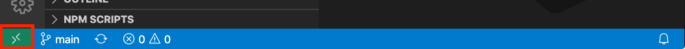
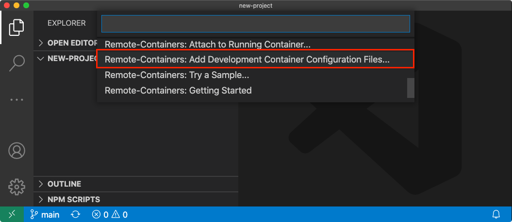
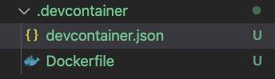
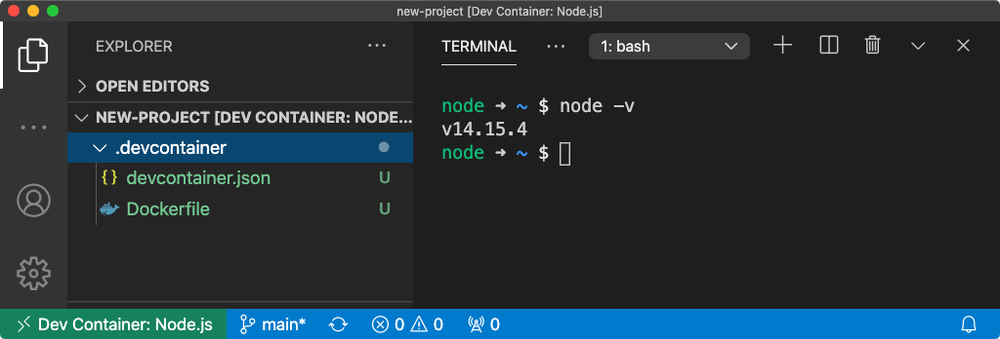
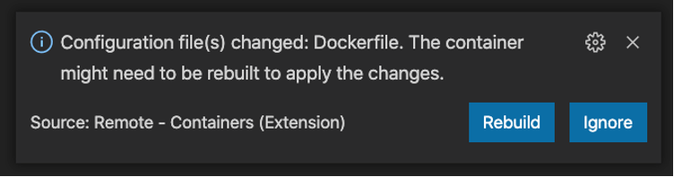

There are 3 things that make me waste a lot of time as a developer, and that can become a big source of frustration:

- Set up a new development machine
- Manage and update my development environment to work on a project
- Reinstall everything again, because after many times installing and updating my dev tools everything broke :(

What if I told you that we can avoid these issues, and that it's possible to perfectly isolate each of your projects' environment? And to be able to share and update it easily, to have nothing to do when a newcomer joins your project?

It's now possible thanks to the [Remote Development extension](https://aka.ms/vscode/remote-dev) for VS Code and containers. In this post, I'll show you how to set up a complete dev environment inside a container and use it with your projects.

## TL;DR key takeaways

- You can quickly onboard a new developer in a project using dev containers, share it with your teammates, and update it with no hassle.
- While nothing prevents you from using Docker and any IDE to do the same thing, the Remote Development extension provides seamless integration with VS Code to bootstrap and work with dev containers.
- Dev containers also allow you to take your dev environment everywhere with online dev tools like [GitHub Codespaces](https://github.com/features/codespaces).

## Why developing *inside* a container

In every software project, the developer story is (almost) always the same:

- "Hey, welcome to the team! We're all excited to have you on board!" 🎉
- "Here's the doc to set up your environment for the project. Let me know when you're ready!" (*spoiler alert:* sometimes there's **no doc** at all, and you'll have to ask your teammates to know what to install)

Most likely, a few hours/days later, the outcome is:

- "Please help, I can't figure out why it's still not building/running properly" 😞


I've been that developer. A few times already.

After a while of spending time reviewing everything you installed, you'll eventually discover common issues usually are:
- The environment setup doc is *outdated* (I bet you didn't see that one coming, right? Isn't that the newcomer's job to update it anyway?).
- You installed the correct tools, but not the right *version* ("Sorry, We forgot to tell you'll have to use this *specific version*, as we have a few issues in our codebase").
- You have some *conflicts* with the environment set up of other projects.

The thing is, we already know how to solve these problems, because that's the *exact same issues* we had with production environments when we ship our applications.

We solved all these problems by packaging the runtime environment of our applications into **containers**. Then, why not also use containers for our *dev environment*?

## Requirements

You need to have these tools installed on your machine to get started:
- [Visual Studio Code](https://code.visualstudio.com)
- [Docker](https://www.docker.com/products/docker-desktop) (or any Docker-compatible client)
- [Remote Development Extension for VS Code](https://aka.ms/vscode/remote-dev)

## Getting started

Open VS Code on a new or existing project, then click on the bottom left
of the status bar, on the "opposing chevron" icon (let me know if you have a better name):



Once you do that, select **Add Development Container Configuration Files...**, and it will open a huge list of environments starters. 



You'll find pre-made configurations for Node.js, Java, .Net, Go, Python, and more, most likely there is one that you can use as a starting point. Once you've made your choice, you'll notice that a new `.devcontainer` folder was created, containing 2 files:



We'll dig into these files just after, for now, let's reload the project to work inside a container. 

Click again on that "opposing chevron" icon in the status bar, and select **Reopen in container**.

VS Code will reload the project's window and start building the container. Depending on your internet connection speed, this may take a while but don't worry, it's only needed the first time.

Once it's finished, you'll see that VS Code is connected to your dev container in the status bar. You can also open a terminal and play with your new dev environment (in my case, I've set up a new Node.js v14 environment).



## Customizing the dev setup

Now that you have a working environment, you'll probably want to customize it for your project's needs. If you unfold the `.devcontainer` folder in the explorer, you'll see these 2 files that will allow you to do that:

- `Dockerfile`: this file defines your container configuration, and is used to build the container image that will be used for your environment. If you need to install additional tools or configure scripts and environment variables for your dev environment, this is where you should look at.

- `devcontainer.json`: this file allows to customize VS Code when the project is connected to a development container. In particular, you can specify VS Code settings, extensions, and port forwarding that will be enabled only in this project dev container.

Let's take a deeper look at how you can fine-tune your VS Code dev environment by editing your `devcontainer.json` file.

### VS Code settings and overrides

You'll see something like this under the `settings` key: 

```json
// Set *default* container specific settings.json values
// on container create.
"settings": { 
  "terminal.integrated.shell.linux": "/bin/bash"
},
```

This key allows you to override any VS Code settings when it's connected to this container environment. For example, if you work on Windows and your default terminal is PowerShell, by connecting to the dev container the setting above with switch your default terminal to Bash instead, which will be run inside the Linux system of the dev container. With these settings, you can set a common code formatter for your team, or force GPG signing for your commits for example.

Another useful option is located under the `extensions` key:

```json
// Add the IDs of the extension you want installed when
// the container is created.
"extensions": [
  "dbaeumeur.vscode-eslint"
],
```

This one allows specifying extensions that will be automatically installed *within* your dev container when it's run for the first time. Yes, you've read that well: these extensions won't pollute your global VS Code configuration, as they'll be available only when your dev container is started and connected to your project. No need to toggle your extensions anymore depending on your active project, no more having a useless C# extension active on your Java project!

One last essential option, `forwardPorts`, allows you to expose ports available from within your dev container and make them accessible by default from your local machine.

```json
// Use 'forwardPorts' to make a list of ports inside the
// container available locally
"forwardPorts": [3000, 4200],
```

For example, if you run a web server within your dev container, without port forwarding you won't be able to access it in your browser. Note that it's also possible to add ports to forward on the fly, by clicking on the antenna icon in the status bar, then selecting `Add Port`:


## Sharing and updating the environment

Once your container and VS Code configuration is finished, you only have to push these two files in your repository to make them available for your team. And it's one of the big benefits of this approach! To welcome a new developer to your project, you now only have to clone the project, reload VS Code to use the container config and that's it. Take a coffee (or many) while the container is downloading and installing tools on its first run, and your new developer will have a dev environment ready for work, without any effort.

Even better, if anyone updates the environment configuration, for example by upgrading a tool's version, everyone in the team will see this notification when pulling the changes:



You then only have to select `Rebuild` to update your environment to the latest version. No more difficulties building a project when coming back from vacation!

## Where's the catch?

> It almost seems too good to be true, so where's the catch?

I've been asking that to myself since I started using it from the first beta, and so far it's been a happy ride. If you wonder about the performance, yes doing everything inside a container is a bit slower than doing it on the host machine, but nothing to worry about. In some cases, you may face disk performance issues especially with lots of small files (looking at you, `npm install`) but there are tips to [improve your filesystem performance with Docker](https://code.visualstudio.com/remote/advancedcontainers/improve-performance).

The only issue I had at the beginning was with my git credentials as I'm using SSH keys, but once I've followed [the guide to set up an SSH agent](https://code.visualstudio.com/docs/remote/containers#_sharing-git-credentials-with-your-container) everything went smoothly.

You can have a look at the [known limitations](https://code.visualstudio.com/docs/remote/containers#_known-limitations), but so far I've yet to have any issue with it.

## What's next

This article is only a brief overview of what's possible with these tools, and of course, you can push it way further if needed, like creating a dev environment using multiple containers for example. You can have a look a the documentation here for more advanced scenarios: [aka.ms/remote-dev-ext/advanced](https://aka.ms/remote-dev-ext/advanced)

Going further, you could still argue that you have to install VS Code with the remote extension and a Docker-compatible runtime to make this work. It's also possible to get rid of that, using for example [GitHub Codespace](https://github.com/features/codespaces) which makes use of the exact same tools and configuration to provide a cloud-based dev environment, accessible from any browser, without having to install anything (but a browser) on your machine.

---

Follow me on [Twitter](http://twitter.com/sinedied), I would be happy to discuss and take your suggestions!
